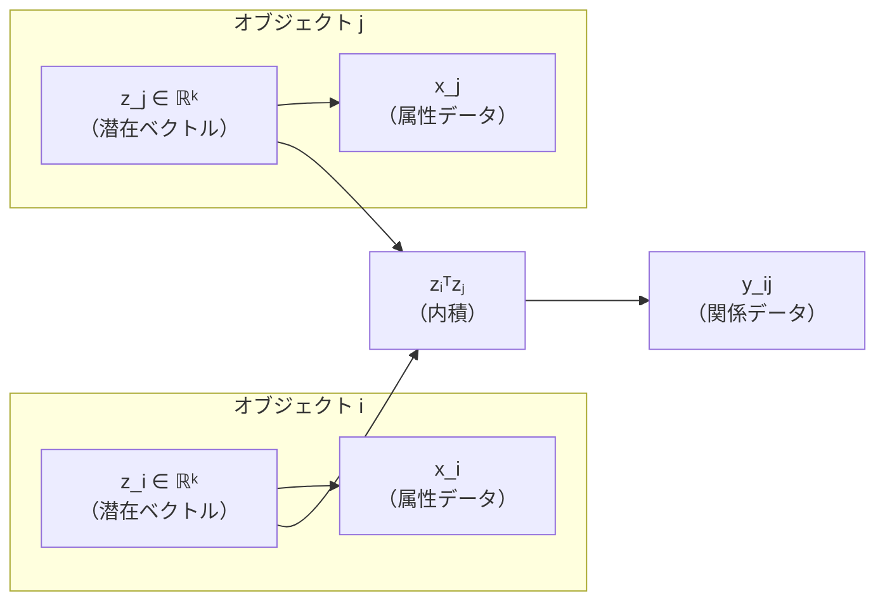
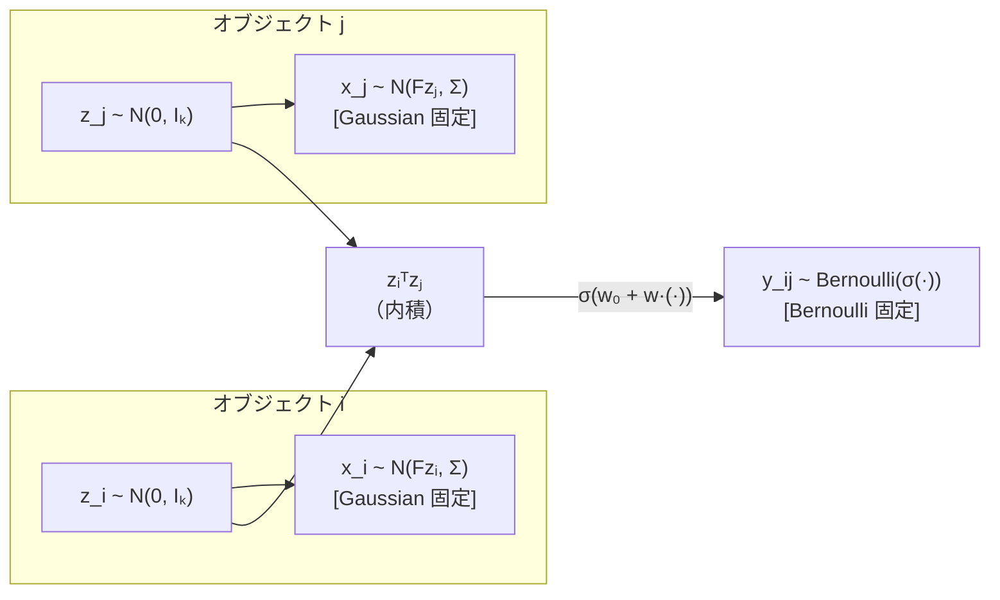

# ゼミ発表メモ：Dual-ExpFam LSM の整理と今後の方向性

**作成日：** 2026-05-19  
**対象：** ゼミ発表（研究整理・議論用）  
**注意：** 完成版の発表資料ではなく、ゼミで議論するための研究整理資料。

---

## 0. 今日議論したいこと

この資料は、研究成果を一方的に報告するためのものではない。  
「**この研究の方向性でよいか**」「**次に何をすべきか**」をゼミで相談することが目的である。

### 今日確認・相談したいこと

| # | 問い | 種別 |
|---|-----|------|
| Q1 | X と Y の両方を指数型分布族へ拡張する方向性は妥当か | 研究の方向性 |
| Q2 | 現在の実験（3シナリオ・誤指定・BIC・先行研究比較）は有効性を示すものとして十分か | 実験設計 |
| Q3 | 次に優先すべき追加実験は何か（従来手法比較・実装精査など） | 実験の優先順位 |
| Q4 | 従来手法を分布が合わないデータに適用した場合との比較をどう設計すべきか | 比較実験の設計 |
| Q5 | X に離散・連続・混合属性が混在する場合、どう扱うべきか | モデル拡張の方向 |
| Q6 | マルチドメイン関係データへ拡張する場合、どのようなモデル設計が必要か | モデル拡張の方向 |
| Q7 | 潜在変数は1種類でよいのか、属性・関係・ドメインごとに分けるべきか | モデル設計 |
| Q8 | 修論・国際学会を見据えたとき、研究の主張の中心をどこに置くべきか | 研究の位置づけ |

---

## 1. 研究の全体像

### 扱うデータ

本研究が扱うのは、**関係データ Y** と**属性データ X** が同時に観測される状況である。

| データ | 記号 | 内容 | 例 |
|-------|------|------|----|
| 関係データ | $Y = (y_{ij})$ | オブジェクト $i$–$j$ 間の関係 | 友人関係・コメント数・類似度 |
| 属性データ | $X = (x_{il})$ | 各オブジェクト $i$ の属性 | 年齢・購買数・所属フラグ |
| 潜在変数 | $Z = (z_i)$ | 各オブジェクトの低次元表現 | 推定対象（$k$ 次元） |

**目標：** $Y$ と $X$ の両方から、共通の低次元潜在変数 $Z$ を推定する。

### 考え方のポイント

各オブジェクト $i$ に $k$ 次元の潜在ベクトル $z_i$ が存在し、

- 属性データ $x_i$ は $z_i$ から生成される
- 関係データ $y_{ij}$ は $z_i$ と $z_j$ の内積に基づいて生成される

と考える。潜在変数 $z_i$ はオブジェクトの特性を低次元に要約したものであり、同じ $z_i$ が属性と関係の両方を説明する。

### 図案：潜在変数の役割（Mermaid）



### 図案：潜在変数の役割（ASCII）

```
オブジェクト i                オブジェクト j
┌──────────┐               ┌──────────┐
│  z_i ∈ ℝᵏ │               │  z_j ∈ ℝᵏ │
└────┬─────┘               └─────┬────┘
     │ F（荷重行列）               │ F（荷重行列）
     ▼                            ▼
  ┌──────┐                     ┌──────┐
  │  x_i  │                     │  x_j  │
  │（属性） │                     │（属性） │
  └──────┘                     └──────┘

     ├─────────── zᵢᵀzⱼ ──────────┤
                    ▼
                ┌──────┐
                │  y_ij │
                │（関係） │
                └──────┘
```

### 本研究での拡張

先行研究では、$x_i$ の生成分布が **Gaussian 固定**、$y_{ij}$ の生成分布が **Bernoulli 固定** だった。  
本研究では、この分布族の指定を**分析者が自由に選べる**ように一般化する。

> **根拠ファイル：** `CLAUDE.md`（生成モデル節）、`docs_for_notebooklm/NOTEBOOKLM_RESEARCH_BRIEF.md` §4

---

## 2. 先行研究 NOLTA 2024 の概要

**文献：** Mikawa et al., "A study on latent structural models for binary relational data with attribute information," NOLTA, IEICE, vol. 15, no. 2, 2024.

### モデルの直感的な説明

先行研究では、各オブジェクト $i$ に潜在ベクトル $z_i$ を仮定する。

- 属性データ $x_i$ は、$z_i$ を平均（の線形変換）とする **Gaussian 分布**から生成される
- 関係データ $y_{ij}$ は、$z_i$ と $z_j$ の内積に基づく **Bernoulli 分布**から生成される
- X は Gaussian 固定、Y は Bernoulli 固定である

### 図案：先行研究の生成モデル（Mermaid）



### 図案：先行研究の生成モデル（ASCII）

```
オブジェクト i                オブジェクト j
┌──────────────────┐       ┌──────────────────┐
│  z_i ~ N(0, Iₖ)    │       │  z_j ~ N(0, Iₖ)    │
└────────┬─────────┘       └─────────┬────────┘
         │ F（荷重行列）               │ F（荷重行列）
         ▼                            ▼
  ┌─────────────────┐         ┌─────────────────┐
  │ x_il ~ N(fₗᵀzᵢ, σₗ²) │         │ x_jl ~ N(fₗᵀzⱼ, σₗ²) │
  │  [Gaussian 固定]    │         │  [Gaussian 固定]    │
  └─────────────────┘         └─────────────────┘

         ├─────── w₀ + w · zᵢᵀzⱼ ──────┤
                        ▼
              ┌─────────────────────────┐
              │  y_ij ~ Bernoulli(σ(·)) │
              │  [Bernoulli 固定]        │
              └─────────────────────────┘
```

### 生成モデルの式（本文）

$$z_i \sim \mathcal{N}(0, I_k)$$

$$x_{il} \sim \mathcal{N}(f_l^\top z_i,\ \sigma_l^2) \quad \text{（X は Gaussian 固定、バイアスなし）}$$

$$y_{ij} \sim \mathrm{Bernoulli}\!\left(\sigma(w_0 + w\, z_i^\top z_j)\right) \quad \text{（Y は Bernoulli 固定、}i < j\text{）}$$

- $w_0, w \in \mathbb{R}$：スカラーパラメータ
- $F \in \mathbb{R}^{d \times k}$：属性荷重行列
- $\sigma(\cdot)$：シグモイド関数

### 推定の流れ

| ステップ | 内容 |
|---------|------|
| 目標 | $p(Z \mid X, Y)$ を推定したい（解析的に困難） |
| E-step | Laplace 近似で $q_i(z_i) = \mathcal{N}(m_i, A_i^{-1})$ を求め、$L$ 個の MC サンプルを生成 |
| M-step | サンプルを使って Q 関数を最大化し、$\{F, \Sigma, w_0, w\}$ を更新 |
| 繰り返し | E-step と M-step を 8 回繰り返す |
| 次元選択 | BIC で潜在次元数 $k$ を選択（$k \in \{1, 2, 3, 4, 5, 6\}$） |

> 🔽 トグル候補：推定アルゴリズムの詳細（Laplace 近似・精度行列）
>
> E-step では、各 $z_i$ の条件付き事後分布を以下のガウス分布で近似する。
>
> $$q_i(z_i) = \mathcal{N}(m_i, A_i^{-1})$$
>
> $m_i$ はニュートン法で求めるモード（事後分布の最大化点）。  
> $A_i$ は精度行列（事後分布の負のヘッセ行列）。
>
> 精度行列 $A_i$ は 3 項の和で表される（詳細は §7 で説明）。
>
> 先行研究の枠組みを継承しつつ、提案手法は $A_i$ の Term2 を一般化している点が核心。

> 🔽 トグル候補：パラメータの定義一覧
>
> | 記号 | 意味 | 形状 | 備考 |
> |------|------|------|------|
> | $n$ | オブジェクト数 | スカラー | 実験: 150 |
> | $d$ | 属性次元数 | スカラー | 実験: 15 |
> | $k$ | 潜在次元数 | スカラー | 真値: 3、探索: 1〜6 |
> | $z_i$ | 潜在ベクトル | $(k,)$ | 推定対象 |
> | $F$ | 属性荷重行列 | $(d, k)$ | 推定パラメータ |
> | $\Sigma$ | 属性データ分散（対角） | $(d, d)$ | Gaussian-X のみ推定 |
> | $w_0^Y, w^Y$ | 関係データのスカラーパラメータ | スカラー | 推定パラメータ |
> | $L$ | MC サンプル数 | スカラー | 実験: 5 |

> **根拠ファイル：** `docs_for_notebooklm/NOTEBOOKLM_RESEARCH_BRIEF.md` §5、原稿 §2.2

---

## 3. 先行研究の限界

### 分布族の固定という制約

先行研究は、$\mathbf{X}$ に **Gaussian**、$\mathbf{Y}$ に **Bernoulli** を固定している。  
この固定はモデルを単純にする一方で、以下の問題を生む。

**実データでは、観測値の型が多様である：**

| データの種類 | 実例 | 自然な分布族 | 先行研究で扱えるか |
|------------|------|------------|:---------------:|
| 連続値属性 | 年齢・売上・スコア | Gaussian | ✓ |
| 二値属性 | 所属有無・購入フラグ | Bernoulli | ✗（固定外） |
| カウント属性 | 訪問回数・投稿数 | Poisson | ✗（固定外） |
| 二値関係 | 友人か否か・リンク有無 | Bernoulli | ✓ |
| カウント関係 | コメント数・取引頻度 | Poisson | ✗（固定外） |
| 連続値関係 | 類似度・強度スコア | Gaussian | ✗（固定外） |

### 問題の本質

分布族が固定されていると、データ型が変わるたびに**モデルを作り直す必要がある**。  
たとえば X がカウントデータ（Poisson が適切）であっても、先行研究のまま Gaussian で近似せざるを得ない。  
このとき、モデルと実データの間に**分布族の誤指定**が生じ、推定精度が悪化する可能性がある。

### 必要なこと

$X$ と $Y$ の分布族を**分析者が柔軟に指定できる**枠組みが必要である。  
しかも、先行研究の推定枠組み（MCEM + Laplace 近似）を大きく変えることなく一般化できることが望ましい。

> **根拠ファイル：** 原稿 §1（L.6-10）、`docs_for_notebooklm/NOTEBOOKLM_RESEARCH_BRIEF.md` §5.4

---

## 4. 本研究の目的

### 一言で言うと

> **X と Y の両方を指数型分布族へ一般化し、Gaussian・Bernoulli・Poisson の任意の組み合わせを一つの枠組みで扱える属性情報付き潜在構造モデルを提案する。**

### 先行研究との関係

| 観点 | 先行研究 (NOLTA 2024) | 本研究 (Dual-ExpFam LSM) |
|-----|---------------------|------------------------|
| X の分布族 | Gaussian **固定** | Gaussian / Bernoulli / Poisson から**任意指定** |
| Y の分布族 | Bernoulli **固定** | Gaussian / Bernoulli / Poisson から**任意指定** |
| 推定枠組み | MCEM + Laplace 近似 | 同上（継承・一般化） |
| 次元選択 | BIC | 同上（一般化） |
| 先行研究との関係 | — | **先行研究を特殊ケースとして含む** |

### 何を新しくしたか

先行研究では E-step の精度行列に $F^\top \Sigma^{-1} F$（Gaussian 専用の項）があった。  
本研究では、これを $F^\top V_X(m_i) F$ に一般化した。  
ここで $V_X$ は X の分布族に応じて変わる行列であり、Gaussian のときは $\Sigma^{-1}$（先行研究と同一）、Bernoulli・Poisson のときは $\mathrm{diag}(A_X''(Fm_i))$ となる。  
**この Term2 の一般化が本研究の核心である。**

> 🔽 トグル候補：精度行列の各項の意味
>
> E-step の精度行列 $A_i$ は以下の 3 項の和：
>
> $$A_i = \underbrace{I_k}_{\text{Term1: Z事前分布}} + \underbrace{F^\top V_X(m_i) F}_{\text{Term2: X情報（本研究の核心）}} + \underbrace{(w^Y)^2 \sum_{j \neq i} A_Y''(\eta_{ij}^Y) z_j z_j^\top}_{\text{Term3: Y情報}}$$
>
> - Term1 は先行研究と同じ（$\sigma_z^2 = 1$ 固定）
> - Term2 は本研究で一般化（X の分布族に応じて $V_X$ が変わる）
> - Term3 は Y 側からの寄与（1/2 係数については §9 補足資料参照）
>
> **根拠ファイル：** 原稿 Eq.(6)、`CLAUDE.md`（精度行列節）

### 将来的な拡張の可能性

本研究の一般化は、以下の拡張へのステップとなりうる。

- **混合属性への拡張：** X の各次元が異なる分布族（連続・二値・カウントの混在）を持つ場合
- **マルチドメイン関係データへの拡張：** 複数種類の関係データ $Y$ を同時に扱う場合
- **潜在変数の設計：** 1 種類の潜在変数でよいか、ドメインごとの潜在変数が必要かの検討

これらは現時点では将来課題であり、今回の発表ではまず**指数型分布族への一般化の有効性**を人工データで確認した結果を報告する。

---

次に、X と Y を同じ枠組みで扱うために使う**指数型分布族**について整理する。

> **根拠ファイル：** 原稿 §1（L.10-11）、`docs_for_notebooklm/NOTEBOOKLM_RESEARCH_BRIEF.md` §6
