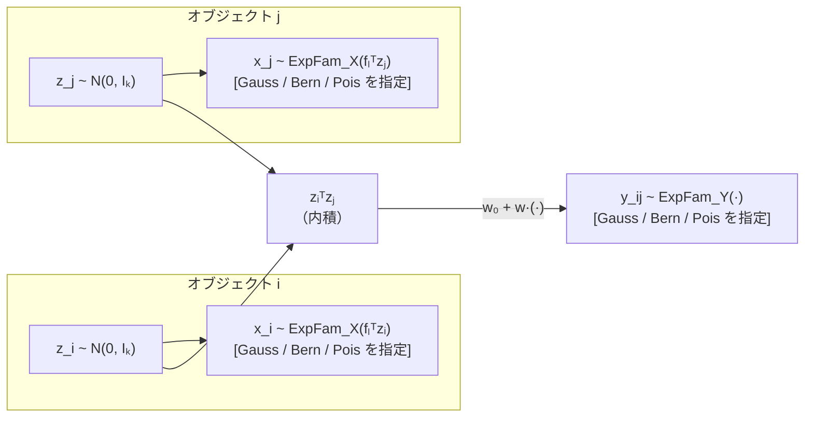

# Notion 本文 Part 2：§5〜§9

**作成日：** 2026-05-19  
**対象：** ゼミ発表（研究整理・議論用）  
**注意：** 完成版の発表資料ではなく、ゼミで議論するための研究整理資料。

---

## 5. 提案手法 Dual-ExpFam LSM の概要

### 5.1 提案手法の一言説明

本研究では、先行研究（NOLTA 2024）で固定されていた属性データ X と関係データ Y の分布族を、指数型分布族として一般化する。  
これにより、**Gaussian・Bernoulli・Poisson などの分布をデータ型に応じて選択できる**属性情報付き潜在構造モデルを実現する。  
推定の枠組み（MCEM + Laplace 近似）は先行研究を継承し、先行研究は本研究の特殊ケースとして含まれる。

---

### 5.2 先行研究との比較表

| 観点 | 先行研究 (NOLTA 2024) | 本研究 (Dual-ExpFam LSM) |
|-----|---------------------|------------------------|
| X の分布族 | Gaussian **固定** | Gaussian / Bernoulli / Poisson から**任意指定** |
| Y の分布族 | Bernoulli **固定** | Gaussian / Bernoulli / Poisson から**任意指定** |
| 潜在変数 Z の事前分布 | $\mathcal{N}(0, I_k)$（固定） | 同上（継承） |
| 推定枠組み | MCEM + Laplace 近似 | 同上（継承・一般化） |
| E-step 精度行列 Term2 | $F^\top \Sigma^{-1} F$（Gauss のみ） | $F^\top V_X(m_i) F$（**任意族に一般化**） |
| F の更新 | 解析解（Gauss のみ） | Gauss: 解析解 / 非 Gauss: Adam 勾配上昇 |
| BIC による次元選択 | あり | あり（一般化） |
| 先行研究との関係 | — | **先行研究を特殊ケースとして含む** |

---

### 5.3 提案手法の生成モデル図案

#### Mermaid 図



#### ASCII 図

```
オブジェクト i                オブジェクト j
┌────────────────────┐     ┌────────────────────┐
│    z_i ~ N(0, Iₖ)   │     │    z_j ~ N(0, Iₖ)   │
└────────┬───────────┘     └───────────┬────────┘
         │ fₗᵀzᵢ                        │ fₗᵀzⱼ
         ▼                              ▼
  ┌────────────────────┐     ┌────────────────────┐
  │ x_i ~ ExpFam_X(·)  │     │ x_j ~ ExpFam_X(·)  │
  │ [任意族を指定]        │     │ [任意族を指定]        │
  └────────────────────┘     └────────────────────┘

         ├──────── zᵢᵀzⱼ（内積） ────────┤
                       ▼
          ┌──────────────────────────────┐
          │  y_ij ~ ExpFam_Y(w₀+w·zᵢᵀzⱼ)  │
          │  [任意族を指定]                 │
          └──────────────────────────────┘
             Gaussian / Bernoulli / Poisson
```

---

### 5.4 本研究で新しくなった点

- **X 側の一般化：** Gaussian 固定 → ExpFam_X（Gauss / Bern / Pois から指定）
- **Y 側の一般化：** Bernoulli 固定 → ExpFam_Y（Gauss / Bern / Pois から指定）
- **精度行列 Term2 の一般化：** $F^\top \Sigma^{-1} F$ → $F^\top V_X(m_i) F$（X の分布族に応じて $V_X$ が変わる）
- **Gaussian-X では従来と同じ解析解で F を更新する**
- **非 Gaussian-X では Adam 勾配上昇で F を更新する**
- 先行研究（Gauss-X, Bern-Y）は本研究の特殊ケースとして含まれ、同一の条件では実質同等の精度を示す

> **根拠ファイル：** `CLAUDE.md`（生成モデル節）、`conference_submission_final_draft.md` §3、`expfam/README.md` §1

---

## 6. 指数型分布族とは何か

### 6.1 直感的な説明

**指数型分布族は、Gaussian・Bernoulli・Poisson などを同じ形で書くための共通言語である。**

分布族ごとに決まる「平均関数 $A'(\eta)$」と「分散関数 $A''(\eta)$」を使うことで、E-step・M-step の式を一度だけ書けば、分布を切り替えるだけで異なるデータ型に対応できる。

---

### 6.2 一般形

指数型分布族の確率分布は以下の形で表される。

$$p(x \mid \eta) = h(x) \exp\!\left\{ T(x)\,\eta - A(\eta) \right\}$$

| 記号 | 名前 | 意味 |
|------|------|------|
| $\eta$ | 自然パラメータ | 分布の形状を決めるパラメータ。本研究では $\eta = f_l^\top z_i$（X側）や $\eta = w_0 + w z_i^\top z_j$（Y側） |
| $T(x)$ | 十分統計量 | 観測値の要約。多くの場合 $T(x) = x$ |
| $A(\eta)$ | 対数分配関数 | 規格化定数。$A'(\eta)$ = 平均関数、$A''(\eta)$ = 分散関数 |
| $h(x)$ | ベース測度 | 分布族ごとの基本係数 |

> 🔽 トグル候補：A'(η) と A''(η) がなぜ重要か
>
> E-step と M-step の式には、以下の量が繰り返し登場する。
>
> - $A'(\eta)$：条件付き期待値 $\mathbb{E}[T(X) \mid \eta]$
>   - 勾配の残差 $T(x) - A'(\eta)$ として使われる
> - $A''(\eta)$：条件付き分散 $\mathrm{Var}(T(X) \mid \eta)$
>   - 精度行列の Term2・Term3 に登場する
>
> この二つを族ごとに定義するだけで、E-step・M-step の一般式が完成する。

---

### 6.3 分布族ごとの対応表

| 分布族 | データの例 | $A'(\eta)$（平均） | $A''(\eta)$（分散） | 本研究での使い方 |
|-------|----------|-----------------|-----------------|--------------|
| Gaussian | 連続属性・類似度 | $\eta$ | $1$（$\sigma^2$ で除す） | X: 先行研究と同一の解析解 / Y: 連続値関係 |
| Bernoulli | 二値属性・リンク有無 | $\sigma(\eta) = \frac{1}{1+e^{-\eta}}$ | $\sigma(\eta)(1-\sigma(\eta))$ | X: 二値属性 / Y: 先行研究と同じ（Bern） |
| Poisson | カウント属性・コメント数 | $\exp(\eta)$ | $\exp(\eta)$ | X: カウント属性 / Y: カウント関係 |

---

### 6.4 なぜ本研究で指数型分布族を使うのか

- **データ型に応じて分布を切り替えられる：** Gaussian・Bernoulli・Poisson など、観測データの型に合わせて選べる
- **X と Y を同じ形式で書ける：** モデルの定式化が統一される
- **E-step・M-step を一般化できる：** $A'(\eta)$ と $A''(\eta)$ を使えば、分布族を変えても同じコード構造で動く
- **将来の拡張への足がかり：** 混合属性（各次元が異なる族）・マルチドメイン関係データへの拡張も、同じ枠組みで記述できる可能性がある

> **根拠ファイル：** `conference_submission_final_draft.md` §2.3、`docs_for_notebooklm/NOTEBOOKLM_RESEARCH_BRIEF.md` §7

---

## 7. 提案モデルの数式

### 7.1 生成モデル

$$z_i \sim \mathcal{N}(0, I_k) \quad \text{（潜在変数の事前分布。$\sigma_z^2 = 1$ 固定）}$$

$$x_{il} \mid z_i \sim \mathrm{ExpFam}_X(\eta_{il}^X), \quad \eta_{il}^X = f_l^\top z_i \quad \text{（属性データの生成。バイアスなし）}$$

$$y_{ij} \mid z_i, z_j \sim \mathrm{ExpFam}_Y(\eta_{ij}^Y), \quad \eta_{ij}^Y = w_0^Y + w^Y z_i^\top z_j \quad (i < j)$$

| 記号 | 意味 |
|------|------|
| $f_l^\top z_i$ | 属性 $l$ の自然パラメータ（$F \in \mathbb{R}^{d \times k}$ の第 $l$ 行 $f_l$ と潜在ベクトルの内積） |
| $w_0^Y, w^Y \in \mathbb{R}$ | 関係データのスカラーパラメータ（**行列ではなくスカラー**） |
| $\mathrm{ExpFam}_X, \mathrm{ExpFam}_Y$ | それぞれ独立に Gaussian / Bernoulli / Poisson から指定 |

---

### 7.2 同時分布・尤度の考え方

$$p(\mathbf{X}, \mathbf{Y}, \mathbf{Z} \mid \boldsymbol{\theta}) = \underbrace{\prod_i p(z_i)}_{\text{Z 事前分布}} \cdot \underbrace{\prod_i \prod_l p_X(x_{il} \mid \eta_{il}^X)}_{\text{X 尤度}} \cdot \underbrace{\prod_{i < j} p_Y(y_{ij} \mid \eta_{ij}^Y)}_{\text{Y 尤度（片側和）}}$$

EM アルゴリズムでは、この対数尤度の潜在変数 $Z$ に関する期待値（Q 関数）を最大化する。

$$\hat{Q}(\boldsymbol{\theta}) = \frac{1}{L} \sum_{l=1}^{L} \log p\!\left(\mathbf{X}, \mathbf{Y}, \mathbf{Z}^{(l)} \mid \boldsymbol{\theta}\right), \quad \mathbf{Z}^{(l)} \sim q(\mathbf{Z})$$

> 🔽 トグル候補：Y 尤度の片側和について
>
> $y_{ij} = y_{ji}$（対称行列）のため、Y 尤度の和を書く記法は 2 通りある。
>
> - 記法 A（全ペア和）：$\frac{1}{2} \sum_{i \neq j} \ln p_Y(y_{ij})$
> - 記法 B（片側和）：$\sum_{i < j} \ln p_Y(y_{ij})$
>
> どちらを使っても値は等しい（対称性より）。  
> M-step の勾配（w0/w 更新）に登場する $\frac{1}{2L}$ は、記法 A の全ペア和 $\sum_{i \neq j}$ を片側和 $\sum_{i < j}$ に換算するための因子であり、**正しい**。  
> 詳細は §7.5 参照。

---

### 7.3 E-step の勾配（各 Term の役割）

E-step では各 $z_i$ の事後分布のモード $m_i$ をニュートン法で探索する。  
対数事後分布の $z_i$ に関する勾配は 3 項の和で表される。

| Term | 由来 | 役割 |
|------|------|------|
| Term1：$-z_i$ | Z の事前分布 | 潜在変数の正則化（原点方向への引き戻し） |
| Term2：X 側の残差項 | X 尤度 | X の観測値と期待値（$A_X'(\eta)$）の残差を $F$ で潜在空間へ戻す。Gaussian-X では分散の逆数を考慮。非 Gaussian-X では ExpFam の平均関数に基づく残差を用いる。詳細は `_calc_gradient` を参照 |
| Term3：$w^Y \sum_{j \neq i} [T_Y(y_{ij}) - A_Y'(\eta_{ij}^Y)] z_j$ | Y 尤度 | Y の残差を隣接する $z_j$ の方向に集約 |

**原稿採用式では Term3 に 1/2 は含まない**（詳細は §7.5 トグル参照）。

> 🔽 トグル候補：E-step 勾配の数式（原稿採用式）
>
> $$\nabla_{z_i} \ln p(z_i \mid \cdot) = \underbrace{-z_i}_{\text{Term1}} + \underbrace{F^\top [x_i - A_X'(Fz_i)]}_{\text{Term2（重み付けは実装参照）}} + \underbrace{w^Y \sum_{j \neq i} [T_Y(y_{ij}) - A_Y'(\eta_{ij}^Y)] z_j}_{\text{Term3（1/2 なし）}}$$
>
> **注意：勾配側の X 項と精度行列側の X 項では、$V_X$ の役割が異なる。**  
> 精度行列側では、Gaussian-X なら $\Sigma^{-1}$、Bernoulli/Poisson-X なら $\mathrm{diag}(A_X''(Fm_i))$ を用いる。  
> 一方、勾配側は観測値と期待値の残差に基づく項として実装（`model_dual_expfam.py` の `_calc_gradient`）を確認すること。
>
> **根拠ファイル：** `docs_for_notebooklm/NOTEBOOKLM_RESEARCH_BRIEF.md` §7.8、`docs/math_notes/half_factor_math_explanation.md`

---

### 7.4 E-step の精度行列（Eq.(6)）

$$A_i = \underbrace{I_k}_{\text{Term1}} + \underbrace{F^\top V_X(m_i) F}_{\text{Term2}} + \underbrace{(w^Y)^2 \sum_{j \neq i} A_Y''(\eta_{ij}^Y)\, z_j z_j^\top}_{\text{Term3（1/2 なし）}}$$

| 項 | 数式 | 意味 | 研究上のポイント |
|---|------|------|--------------|
| Term1 | $I_k$ | Z 事前分布の寄与（$\sigma_z^2 = 1$ 固定） | 先行研究と同じ |
| Term2 | $F^\top V_X(m_i) F$ | X 情報の寄与 | **本研究の一般化の核心**。X の族によって $V_X$ が変わる |
| Term3 | $(w^Y)^2 \sum_{j \neq i} A_Y''(\eta_{ij}^Y) z_j z_j^\top$ | Y 情報の寄与 | 原稿採用式では**1/2 なし** |

$V_X$ の定義：

| $\mathrm{ExpFam}_X$ | $V_X$ |
|---------------------|-------|
| Gaussian | $\Sigma^{-1}$（対角逆分散行列）— 先行研究と同一 |
| Bernoulli / Poisson | $\mathrm{diag}(A_X''(Fm_i))$（分散関数の対角行列）— **本研究で追加** |

Laplace 近似：$q_i(z_i) = \mathcal{N}(m_i, A_i^{-1})$ で事後分布を近似し、$L$ 個の MC サンプルを生成する。

---

### 7.5 1/2 係数問題

> 🔽 トグル候補：1/2 係数問題の整理
>
> #### 結論
>
> NOLTA 2024 PDF Eq.(22)(23) には E-step 勾配・精度行列の Y 側 Term3 に 1/2 が含まれているが、本研究の再導出および MATLAB 実装（`calcEtaNewton.m` の `calcAi` 関数）とは不一致であり、本研究では **1/2 なしの式を原稿採用式として整理する**。
>
> #### 各記法・実装での 1/2 の有無
>
> | 資料 | 精度行列 Term3 | E-step 勾配 Term3 | 判断 |
> |-----|:---:|:---:|------|
> | 原稿 Eq.(6) | **なし** ✓ | — | 正しい（採用） |
> | MATLAB `calcAi`（`calcEtaNewton.m`） | **なし** ✓ | **なし** ✓ | 正しい |
> | NOLTA 2024 PDF Eq.(22)(23) | **あり** | **あり** | 本研究の再導出・MATLAB 実装とは不一致 |
> | Python 実装 L.200（`model_dual_expfam.py`） | **0.5 あり** | — | 不整合（修論フェーズで修正予定） |
> | Python 実装 L.159（`model_dual_expfam.py`） | — | **0.5 あり** | 不整合（同上） |
>
> #### 1/2 がなぜ消えるか（数学的根拠の概要）
>
> Y 尤度を $\frac{1}{2}\sum_{i \neq j}(\cdots)$（記法 A）で書いても、$z_i$ について微分すると「$a = i$ の項」と「$b = i$ の項」が合算され、結果として $\sum_{j \neq i}(\cdots)$ になる（1/2 が消える）。  
> 詳細：`docs/math_notes/half_factor_math_explanation.md`
>
> #### 正しい 1/2（誤解しないこと）
>
> | 場所 | 1/2 の有無 | 正誤 | 理由 |
> |-----|:---:|:---:|------|
> | Q 関数 Y 側（`calc_log_likelihood_Y`） | **0.5 あり** | ✓ 正しい | $\sum_{i<j}$ を $\frac{1}{2}\sum_{i \neq j}$ で表現するため |
> | M-step 勾配 w0/w の `/2L`（`calc_w0`・`calc_w`） | **1/2L あり** | ✓ 正しい | $\sum_{i \neq j}$ を $\sum_{i<j}$ に換算するため |
> | E-step 勾配 Term3（`_calc_gradient` L.159） | **0.5 あり** | **✗ 不整合** | 余分な 0.5。修論フェーズで修正予定 |
> | E-step 精度行列 Term3（`_calc_precision_matrix` L.200） | **0.5 あり** | **✗ 不整合** | 同上 |
>
> #### Newton 方向への影響
>
> 0.5 が掛かっているのは Y 側 Term3 のみ（Term1・Term2 は正しい）。  
> Y 側が支配的な状況では近似的に打ち消される可能性があるが、**Newton 方向が原稿採用式と完全に一致するとは断定できない**（Term1・Term2 とスケールが異なるため）。  
> 修正は修論フェーズで対応予定。現時点では触らない。
>
> **根拠ファイル：** `docs/math_notes/half_factor_math_explanation.md`、`docs/math_notes/half_factor_literature_code_check.md`、`docs_for_notebooklm/01_formula_code_audit.md`

> **根拠ファイル（§7 全体）：** `conference_submission_final_draft.md` Eq.(4)-(6)、`CLAUDE.md`（精度行列節）

---

## 8. 推定アルゴリズムの流れ

### 8.1 なぜ近似推定が必要か

$p(Z \mid X, Y)$ を直接計算したい。しかし、$\eta_{ij}^Y = w_0 + w\, z_i^\top z_j$ に $z_i^\top z_j$ が含まれるため、$z_i$ と $z_j$ が結合しており、解析的な閉形式解を得ることが難しい。  
そこで以下の二つの近似を組み合わせる。

- **Laplace 近似：** 各 $z_i$ の条件付き事後分布を $\mathcal{N}(m_i, A_i^{-1})$ で局所近似する
- **Monte Carlo EM（MCEM）：** 近似した事後分布から $L$ 個のサンプルを生成し、Q 関数を MC 近似する

---

### 8.2 アルゴリズム全体の流れ

#### Mermaid フローチャート

```mermaid
flowchart TD
    A["初期化\nF, w₀ʸ, wʸ を設定"] --> B
    B["E-step\n各 i について Newton 法でモード m_i を探索\n（∇_{z_i}・A_i を使う）"] --> C
    C["Laplace 近似\nq_i(z_i) = N(m_i, A_i⁻¹)"] --> D
    D["Z サンプリング\nZ^(1), ..., Z^(L)  (L = 5)"] --> E
    E["M-step\nF, w₀ʸ, wʸ, Σ, σ_y を更新"] --> F
    F{8 回繰り返したか？}
    F -->|No| B
    F -->|Yes| G["BIC を計算\nk を選択（k ∈ {1,…,6}）"]
    G --> H[RMSE(Z) を評価]
```

#### ASCII フローチャート

```
初期化（F, w₀, w を設定）
         │
         ▼
┌──── E-step ──────────────────────────────────────────┐
│  for i = 1 to n:                                      │
│    ニュートン法で m_i を探索（_calc_gradient 使用）     │
│    精度行列 A_i を計算（_calc_precision_matrix 使用）  │
│    q_i(z_i) = N(m_i, A_i⁻¹)                         │
│    Z_i^(1), ..., Z_i^(L) をサンプリング               │
└──────────────────────────────────────────────────────┘
         │
         ▼
┌──── M-step ──────────────────────────────────────────┐
│  F    ← Gauss-X: 解析解 / 非 Gauss: Adam            │
│  Σ    ← Gauss-X: 解析解 MLE / 非 Gauss: I_d に固定  │
│  w₀, w ← Adam（/2L は正しい）                         │
│  σ_y  ← Gauss-Y: 解析解 MLE / 非 Gauss: 不要         │
└──────────────────────────────────────────────────────┘
         │
    8 回繰り返す
         │
         ▼
  BIC で k を選択 → RMSE(Z)・RMSE(F)・RMSE(Y) を評価
```

---

### 8.3 E-step でやること

1. 各オブジェクト $i$ について、$\ln p(z_i \mid X, Y, Z_{-i}, \theta)$ のモード $m_i$ をニュートン法で探索する
2. 精度行列 $A_i$（= 負の Hessian）を計算する（Eq.(6)）
3. $q_i(z_i) = \mathcal{N}(m_i, A_i^{-1})$ から $L = 5$ 個のサンプルを生成する

> 🔽 トグル候補：E-step のニュートン法の詳細
>
> ニュートン法では、勾配（`_calc_gradient`）と精度行列 $A_i$（`_calc_precision_matrix`）を用いて $z_i$ をモード $m_i$ に近づける。  
> 詳細な更新式の符号規約は `utils_expfam.py` の `run_em_dual` に従う。  
> ステップサイズ `newton_alpha`（デフォルト 0.5）は、収束失敗時に自動で半減して再試行する。
>
> **根拠ファイル：** `expfam/src/utils_expfam.py`（`run_em_dual`）

---

### 8.4 M-step でやること

| パラメータ | 更新方法 | 条件 |
|-----------|---------|------|
| $F$（属性荷重行列） | **解析解**（先行研究 NOLTA 2024 Eq.(10) と同一） | $\mathrm{ExpFam}_X$ = Gaussian のとき |
| $F$（属性荷重行列） | **Adam 勾配上昇**（$\nabla_F = \frac{1}{L}\sum_l [X - A_X'(ZF^\top)]^\top Z_l$） | 非 Gaussian-X のとき |
| $\Sigma$（Gauss-X 分散） | **解析解 MLE** | $\mathrm{ExpFam}_X$ = Gaussian のとき |
| $\Sigma$ | $I_d$ に固定 | 非 Gaussian-X のとき |
| $w_0^Y, w^Y$ | **Adam**（勾配を $2L$ で除す。正しい） | 常に |
| $\sigma_y^2$（Gauss-Y 分散） | **解析解 MLE** | $\mathrm{ExpFam}_Y$ = Gaussian のとき |

Adam の設定：学習率 $\alpha = 0.01$、$\beta_1 = 0.9$、$\beta_2 = 0.999$、最大 50 反復

> **根拠ファイル：** `conference_submission_final_draft.md` §3.3、`docs_for_notebooklm/NOTEBOOKLM_RESEARCH_BRIEF.md` §8、`expfam/src/model_dual_expfam.py`（`calc_F`・`_calc_F_adam`）

---

## 9. 実装との対応

### 9.1 クラス継承構造

| クラス | ファイル | 役割 |
|-------|---------|------|
| `LatentStructuralModel` | `reproduction/src/model.py` | 先行研究（NOLTA 2024）の Python 再現。**ベースクラス** |
| `ExpFamLatentStructuralModel` | `expfam/src/model_expfam.py` | Y 側を ExpFam に拡張。w0/w の Adam 更新・sigma_y 推定を追加 |
| `DualExpFamLSM` | `expfam/src/model_dual_expfam.py` | **提案手法本体**。X・Y 両方を ExpFam に拡張。`_calc_gradient` と `_calc_precision_matrix` を完全オーバーライド |

```
reproduction/src/model.py
    └── LatentStructuralModel
          └── expfam/src/model_expfam.py
                └── ExpFamLatentStructuralModel
                      └── expfam/src/model_dual_expfam.py
                            └── DualExpFamLSM  ← 提案手法
```

---

### 9.2 主要ファイル対応表

| ファイル | 役割 | 読む場面 |
|---------|------|---------|
| `expfam/src/model_dual_expfam.py` | 提案手法核心（E-step・M-step） | 実装を確認するとき |
| `expfam/src/model_expfam.py` | Y 側 ExpFam 拡張・w0/w 更新・sigma_y | Y 側パラメータを確認するとき |
| `expfam/src/utils_expfam.py` | EM 実行・Q 関数・BIC・RMSE・Procrustes | 実験の実行・評価を確認するとき |
| `expfam/src/data_generator_expfam.py` | 人工データ生成 | データ生成を確認するとき |
| `expfam/src/exp_scenario_lib.py` | 実験共通設定・実験関数 | 実験設定（n/d/k/試行数）を確認するとき |
| `expfam/src/exp_run_scenario_A.py` | シナリオ A（Pois-X, Bern-Y）実行 | シナリオ A の実験を回すとき |
| `expfam/src/exp_run_scenario_B.py` | シナリオ B（Gauss-X, Pois-Y）実行 | シナリオ B の実験を回すとき |
| `expfam/src/exp_run_scenario_C.py` | シナリオ C（Bern-X, Gauss-Y）実行 | シナリオ C の実験を回すとき |

---

### 9.3 数式と実装の対応表

| 数式・処理 | 実装ファイル | 関数名 | 注意点 |
|----------|------------|--------|-------|
| E-step 勾配（Term1/2/3） | `model_dual_expfam.py` | `_calc_gradient` (L.123) | **L.159 に余分な 0.5** |
| E-step 精度行列（Term1/2/3） | `model_dual_expfam.py` | `_calc_precision_matrix` (L.167) | **L.200 に余分な 0.5** |
| F 更新（Gauss-X: 解析解） | `model_dual_expfam.py` | `calc_F` → 親クラスへ委譲 (L.208) | 先行研究と同一の解析解 |
| F 更新（非 Gauss: Adam） | `model_dual_expfam.py` | `_calc_F_adam` (L.219) | Adam 勾配上昇（最大化） |
| Σ 更新（Gauss-X） | `model_dual_expfam.py` | `calc_sigma` → 親クラスへ委譲 | 非 Gauss は $I_d$ に固定 |
| w0/w 更新（Adam） | `model_expfam.py` | `calc_w0` (L.149)・`calc_w` (L.180) | `/2L` は正しい |
| sigma_y 更新（Gauss-Y） | `model_expfam.py` | `calc_sigma_y` (L.212) | Gauss-Y のみ推定 |
| Q 関数（Dual） | `utils_expfam.py` | `calc_Q_dual` (L.324) | モニタリング用（factorial 除外） |
| Q 関数（BIC 用 strict） | `utils_expfam.py` | `calc_Q_dual_strict` (L.355) | Poisson の $-\sum\ln(y!)$ を追加 |
| BIC 計算 | `utils_expfam.py` | `calc_bic_dual` (L.386) | w0/w はパラメータ数から除外（NOLTA 2024 慣行） |
| Procrustes 回転 + RMSE(Z) | `utils_expfam.py` | `procrustes_rotation` (L.38)・`run_em_dual` (L.555) | 全実験で適用済み |
| 実験実行（EM ループ） | `utils_expfam.py` | `run_em_dual` (L.407) | 失敗時に `newton_alpha` を半減して再試行 |

---

### 9.4 実装上の注意点

> 🔽 トグル候補：実装を扱うときに必ず確認すること
>
> **1. E-step Y 側 Term3 に 0.5 が残存している**
>
> | 場所 | 内容 | 原稿採用式との差 |
> |-----|------|----------------|
> | `model_dual_expfam.py` L.159 | `term3 = 0.5 * w * (Z.T @ residual_y)` | 余分な `0.5` |
> | `model_dual_expfam.py` L.200 | `term3 = 0.5 * (w**2) * (...)` | 余分な `0.5` |
>
> 原稿採用式では 1/2 なし。修論フェーズで修正予定。**現時点では触らない。**
>
> **2. 参照する CLAUDE.md の優先順位**
>
> - `expfam/CLAUDE.md` は旧 Gemini セッション向けの旧ファイル。現在の確定事項とは異なる場合がある
> - **root の `CLAUDE.md` を優先する**
>
> **3. AI 生成レポートは主根拠にしない**
>
> - `expfam/results/GEMINI_REPORT_*.md` は AI 生成・研究者による検証未完了
> - CSV・コード・原稿で直接確認できた内容だけを根拠とする
>
> **4. 提出用図は root `figures/` を使う**
>
> - `expfam/results/` 内の図は旧版（2026-03-24 版）
> - **提出用最終版は `figures/fig1a_n_sweep_color.*`・`figures/fig1b_misspecification_color.*`（2026-05-07 版）**
>
> **5. Python path の設定**
>
> `DualExpFamLSM` は `reproduction/src/model.py` の `LatentStructuralModel` を継承している。  
> Jupyter 等から直接実行するときは以下を手動で設定すること。
>
> ```python
> import sys
> sys.path.insert(0, '../../reproduction/src')
> ```
>
> 各実験スクリプト（`exp_run_scenario_*.py`）には自動設定コードが含まれている。

> **根拠ファイル：** `expfam/README.md` §4・§5・§7、`docs_for_notebooklm/01_formula_code_audit.md` §5、`CLAUDE.md`（精度行列節）
