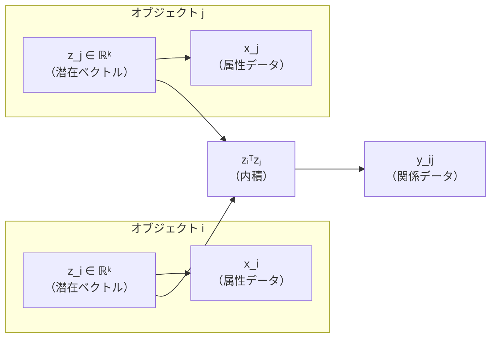
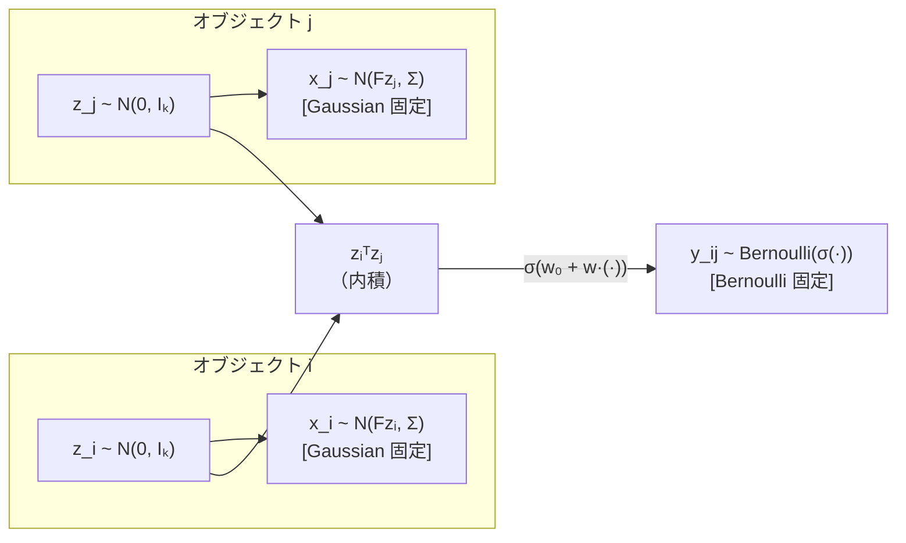
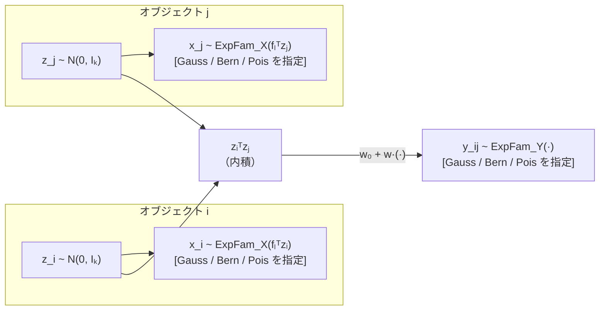

# ゼミ発表メモ：Dual-ExpFam LSM の整理と今後の方向性（数式強化版）

**作成日：** 2026-05-19（数式強化版 formula_rich）  
**対象：** ゼミ発表（研究整理・議論用）  
**注意：** 完成版の発表資料ではなく、ゼミで議論するための研究整理資料。  
**本ファイルについて：** `seminar_notion_full.md` をベースに数式を強化した版。原版は上書きしていない。

---

## 0. 今日議論したいこと

この資料は、研究成果を一方的に報告するためのものではない。  
「**この研究の方向性でよいか**」「**次に何をすべきか**」をゼミで相談することが目的である。

| # | 問い | 種別 |
|---|-----|------|
| Q1 | X と Y の両方を指数型分布族へ拡張する方向性は妥当か | 研究の方向性 |
| Q2 | 現在の実験（3シナリオ・誤指定・BIC・先行研究比較）は有効性を示すものとして十分か | 実験設計 |
| Q3 | 次に優先すべき追加実験は何か（従来手法比較・実装精査など） | 実験の優先順位 |
| Q4 | 従来手法を分布が合わないデータに適用した場合との比較をどう設計すべきか | 比較実験の設計 |
| Q5 | X に離散・連続・混合属性が混在する場合、どう扱うべきか | モデル拡張の方向 |
| Q6 | マルチドメイン関係データへ拡張する場合、どのようなモデル設計が必要か | モデル拡張の方向 |
| Q7 | 潜在変数は1種類でよいのか、属性・関係・ドメインごとに分けるべきか | モデル設計 |
| Q8 | 修論・国際学会を見据えたとき、研究の主張の中心をどこに置くべきか | 研究の位置づけ |

詳細は §15 で再整理する。

---

## 1. 研究の全体像

### 扱うデータ

本研究が扱うのは、**関係データ Y** と**属性データ X** が同時に観測される状況である。

| データ | 記号 | 内容 | 例 |
|-------|------|------|----|
| 関係データ | $Y = (y_{ij})$ | オブジェクト $i$–$j$ 間の関係 | 友人関係・コメント数・類似度 |
| 属性データ | $X = (x_{il})$ | 各オブジェクト $i$ の属性 | 年齢・購買数・所属フラグ |
| 潜在変数 | $Z = (z_i)$ | 各オブジェクトの低次元表現 | 推定対象（$k$ 次元） |

**目標：** $Y$ と $X$ の両方から、共通の低次元潜在変数 $Z$ を推定する。

### 考え方のポイント

各オブジェクト $i$ に $k$ 次元の潜在ベクトル $z_i$ が存在し、属性データ $x_i$ は $z_i$ から生成され、関係データ $y_{ij}$ は $z_i$ と $z_j$ の内積に基づいて生成されると考える。同じ $z_i$ が属性と関係の両方を説明する。

### 図案：潜在変数の役割（Mermaid）



### 図案：潜在変数の役割（ASCII）

```
オブジェクト i                オブジェクト j
┌──────────┐               ┌──────────┐
│  z_i ∈ ℝᵏ │               │  z_j ∈ ℝᵏ │
└────┬─────┘               └─────┬────┘
     │ F（荷重行列）               │ F（荷重行列）
     ▼                            ▼
  ┌──────┐                     ┌──────┐
  │  x_i  │                     │  x_j  │
  │（属性） │                     │（属性） │
  └──────┘                     └──────┘

     ├─────────── zᵢᵀzⱼ ──────────┤
                    ▼
                ┌──────┐
                │  y_ij │
                │（関係） │
                └──────┘
```

本研究では、$x_i$ の生成分布が **Gaussian 固定**、$y_{ij}$ の生成分布が **Bernoulli 固定** だった先行研究を、分布族を**分析者が自由に選べる**ように一般化する。

> **根拠ファイル：** `CLAUDE.md`（生成モデル節）、`docs_for_notebooklm/NOTEBOOKLM_RESEARCH_BRIEF.md` §4

---

## 2. 先行研究 NOLTA 2024 の概要

**文献：** Mikawa et al., "A study on latent structural models for binary relational data with attribute information," NOLTA, IEICE, vol. 15, no. 2, 2024.

### モデルの直感的な説明

先行研究では、各オブジェクト $i$ に潜在ベクトル $z_i$ を仮定する。属性データ $x_i$ は $z_i$ を平均（の線形変換）とする **Gaussian 分布**から、関係データ $y_{ij}$ は $z_i$ と $z_j$ の内積に基づく **Bernoulli 分布**から生成される。X は Gaussian 固定、Y は Bernoulli 固定。

### 図案：先行研究の生成モデル（Mermaid）



### 図案：先行研究の生成モデル（ASCII）

```
オブジェクト i                オブジェクト j
┌──────────────────┐       ┌──────────────────┐
│  z_i ~ N(0, Iₖ)    │       │  z_j ~ N(0, Iₖ)    │
└────────┬─────────┘       └─────────┬────────┘
         │ F（荷重行列）               │ F（荷重行列）
         ▼                            ▼
  ┌─────────────────┐         ┌─────────────────┐
  │ x_il ~ N(fₗᵀzᵢ, σₗ²) │         │ x_jl ~ N(fₗᵀzⱼ, σₗ²) │
  │  [Gaussian 固定]    │         │  [Gaussian 固定]    │
  └─────────────────┘         └─────────────────┘

         ├─────── w₀ + w · zᵢᵀzⱼ ──────┤
                        ▼
              ┌─────────────────────────┐
              │  y_ij ~ Bernoulli(σ(·)) │
              │  [Bernoulli 固定]        │
              └─────────────────────────┘
```

### 生成モデルの式（本文）

$$z_i \sim \mathcal{N}(0, I_k), \quad x_{il} \sim \mathcal{N}(f_l^\top z_i,\ \sigma_l^2), \quad y_{ij} \sim \mathrm{Bernoulli}\!\left(\sigma(w_0 + w\, z_i^\top z_j)\right) \quad (i < j)$$

- $w_0, w \in \mathbb{R}$：スカラーパラメータ（行列ではない）
- $F \in \mathbb{R}^{d \times k}$：属性荷重行列（バイアスなし）
- $\sigma(\cdot)$：シグモイド関数

### 推定の流れ

| ステップ | 内容 |
|---------|------|
| 目標 | $p(Z \mid X, Y)$ を推定したい（解析的に困難） |
| E-step | Laplace 近似で $q_i(z_i) = \mathcal{N}(m_i, A_i^{-1})$ を求め、$L$ 個の MC サンプルを生成 |
| M-step | サンプルを使って Q 関数を最大化し、$\{F, \Sigma, w_0, w\}$ を更新 |
| 繰り返し | E-step と M-step を 8 回繰り返す |
| 次元選択 | BIC で潜在次元数 $k$ を選択（$k \in \{1,2,3,4,5,6\}$） |

> 🔽 トグル候補：パラメータの定義一覧
>
> | 記号 | 意味 | 形状 | 備考 |
> |------|------|------|------|
> | $n$ | オブジェクト数 | スカラー | 実験: 150 |
> | $d$ | 属性次元数 | スカラー | 実験: 15 |
> | $k$ | 潜在次元数 | スカラー | 真値: 3、探索: 1〜6 |
> | $z_i$ | 潜在ベクトル | $(k,)$ | 推定対象 |
> | $F$ | 属性荷重行列 | $(d, k)$ | 推定パラメータ |
> | $\Sigma$ | 属性データ分散（対角） | $(d, d)$ | Gaussian-X のみ推定 |
> | $w_0^Y, w^Y$ | 関係データのスカラーパラメータ | スカラー | 推定パラメータ |
> | $L$ | MC サンプル数 | スカラー | 実験: 5 |

> **根拠ファイル：** `docs_for_notebooklm/NOTEBOOKLM_RESEARCH_BRIEF.md` §5、原稿 §2.2

---

## 3. 先行研究の限界

先行研究は、$X$ に **Gaussian**、$Y$ に **Bernoulli** を固定している。実データでは観測値の型が多様であり、この固定が問題になる。

| データの種類 | 実例 | 自然な分布族 | 先行研究で扱えるか |
|------------|------|------------|:---------------:|
| 連続値属性 | 年齢・売上・スコア | Gaussian | ✓ |
| 二値属性 | 所属有無・購入フラグ | Bernoulli | ✗（固定外） |
| カウント属性 | 訪問回数・投稿数 | Poisson | ✗（固定外） |
| 二値関係 | 友人か否か・リンク有無 | Bernoulli | ✓ |
| カウント関係 | コメント数・取引頻度 | Poisson | ✗（固定外） |
| 連続値関係 | 類似度・強度スコア | Gaussian | ✗（固定外） |

分布族が固定されていると、データ型が変わるたびに**モデルを作り直す必要がある**。分布族の誤指定が生じると推定精度が悪化する可能性がある。$X$ と $Y$ の分布族を**分析者が柔軟に指定できる**枠組みが必要である。

> **根拠ファイル：** 原稿 §1（L.6-10）、`docs_for_notebooklm/NOTEBOOKLM_RESEARCH_BRIEF.md` §5.4

---

## 4. 本研究の目的

> **X と Y の両方を指数型分布族へ一般化し、Gaussian・Bernoulli・Poisson の任意の組み合わせを一つの枠組みで扱える属性情報付き潜在構造モデルを提案する。**

提案手法により、データ型に応じて分布族を選択できる枠組みを用いることで、分布族固定による誤指定の影響を軽減できる可能性を検証する。先行研究（Gauss-X / Bern-Y）は本研究の特殊ケースとして含まれる。

将来的には、**混合属性**（各次元が異なる族を持つ X）・**マルチドメイン関係データ**（複数種類の Y）・**潜在変数設計の見直し**へのステップとなりうる（§14 で詳述）。

次に、X と Y を同じ枠組みで扱うために使う**指数型分布族**について整理する。

> **根拠ファイル：** 原稿 §1（L.10-11）、`docs_for_notebooklm/NOTEBOOKLM_RESEARCH_BRIEF.md` §6

---

## 5. 提案手法 Dual-ExpFam LSM の概要

### 提案手法の一言説明

先行研究で固定されていた属性データ X と関係データ Y の分布族を、指数型分布族として一般化する。**Gaussian・Bernoulli・Poisson などの分布をデータ型に応じて選択できる**属性情報付き潜在構造モデルを実現する。

### 推定パラメータ集合

$$\boldsymbol{\theta} = \{F,\, w_0^Y,\, w^Y\}$$

Gaussian-X のとき対角分散行列 $\boldsymbol{\Sigma}$ を追加で推定する。  
Gaussian-Y のとき $\sigma_y^2$ を追加で推定する。  
$w_0^Y, w^Y$ は**スカラー**（行列ではない）。

### 先行研究との比較

| 観点 | 先行研究 (NOLTA 2024) | 本研究 (Dual-ExpFam LSM) |
|-----|---------------------|------------------------|
| X の分布族 | Gaussian **固定** | Gaussian / Bernoulli / Poisson から**任意指定** |
| Y の分布族 | Bernoulli **固定** | Gaussian / Bernoulli / Poisson から**任意指定** |
| 潜在変数 Z の事前分布 | $\mathcal{N}(0, I_k)$（固定） | 同上（継承） |
| 推定枠組み | MCEM + Laplace 近似 | 同上（継承・一般化） |
| E-step 精度行列 Term2 | $F^\top \Sigma^{-1} F$（Gauss のみ） | $F^\top V_X(m_i) F$（**任意族に一般化**） |
| F の更新 | 解析解（Gauss のみ） | Gauss: 解析解 / 非 Gauss: Adam 勾配上昇 |
| BIC による次元選択 | あり | あり（一般化） |
| 先行研究との関係 | — | **先行研究を特殊ケースとして含む** |

### 提案手法の生成モデル図案（Mermaid）



### 提案手法の生成モデル図案（ASCII）

```
オブジェクト i                オブジェクト j
┌────────────────────┐     ┌────────────────────┐
│    z_i ~ N(0, Iₖ)   │     │    z_j ~ N(0, Iₖ)   │
└────────┬───────────┘     └───────────┬────────┘
         │ fₗᵀzᵢ                        │ fₗᵀzⱼ
         ▼                              ▼
  ┌────────────────────┐     ┌────────────────────┐
  │ x_i ~ ExpFam_X(·)  │     │ x_j ~ ExpFam_X(·)  │
  │ [任意族を指定]        │     │ [任意族を指定]        │
  └────────────────────┘     └────────────────────┘

         ├──────── zᵢᵀzⱼ（内積） ────────┤
                       ▼
          ┌──────────────────────────────┐
          │  y_ij ~ ExpFam_Y(w₀+w·zᵢᵀzⱼ)  │
          │  [任意族を指定]                 │
          └──────────────────────────────┘
             Gaussian / Bernoulli / Poisson
```

### 本研究で新しくなった点

- **X 側の一般化：** Gaussian 固定 → ExpFam_X（Gauss / Bern / Pois から指定）
- **Y 側の一般化：** Bernoulli 固定 → ExpFam_Y（Gauss / Bern / Pois から指定）
- **精度行列 Term2 の一般化：** $F^\top \Sigma^{-1} F$ → $F^\top V_X(m_i) F$（X の分布族に応じて $V_X$ が変わる）
- Gaussian-X では従来と同じ解析解で F を更新する
- 非 Gaussian-X では Adam 勾配上昇で F を更新する

> **根拠ファイル：** `CLAUDE.md`（生成モデル節）、`conference_submission_final_draft.md` §3、`expfam/README.md` §1

---

## 6. 指数型分布族とは何か

**指数型分布族は、Gaussian・Bernoulli・Poisson などを同じ形で書くための共通言語である。**

分布族ごとに決まる「平均関数 $A'(\eta)$」と「分散関数 $A''(\eta)$」を使うことで、E-step・M-step の式を一度だけ書けば、分布を切り替えるだけで異なるデータ型に対応できる。

### 一般形

$$p(x \mid \eta) = h(x) \exp\!\left\{ \eta\, T(x) - A(\eta) \right\}$$

| 記号 | 名前 | 意味 |
|------|------|------|
| $\eta$ | 自然パラメータ | X 側：$\eta = f_l^\top z_i$、Y 側：$\eta = w_0 + w z_i^\top z_j$ |
| $T(x)$ | 十分統計量 | 観測値の要約。多くの場合 $T(x) = x$ |
| $A'(\eta)$ | 平均関数 | 条件付き期待値 $\mathbb{E}[T(X) \mid \eta]$。勾配の残差に登場 |
| $A''(\eta)$ | 分散関数 | 条件付き分散。精度行列の Term2・Term3 に登場 |

### 分布族ごとの対応表

| 分布族 | データの例 | $A'(\eta)$（平均） | $A''(\eta)$（分散） | 本研究での使い方 |
|-------|----------|-----------------|-----------------|--------------|
| Gaussian | 連続属性・類似度 | $\eta$ | $1$（$\sigma^2$ で除す） | X: 先行研究と同一 / Y: 連続値関係 |
| Bernoulli | 二値属性・リンク有無 | $\sigma(\eta)$ | $\sigma(\eta)(1-\sigma(\eta))$ | X: 二値属性 / Y: 先行研究と同じ（Bern） |
| Poisson | カウント属性・コメント数 | $\exp(\eta)$ | $\exp(\eta)$ | X: カウント属性 / Y: カウント関係 |

> **根拠ファイル：** `conference_submission_final_draft.md` §2.3、`docs_for_notebooklm/NOTEBOOKLM_RESEARCH_BRIEF.md` §7

---

## 7. 提案モデルの数式

### 生成モデル

$$z_i \sim \mathcal{N}(0, I_k) \quad \text{（潜在変数の事前分布。$\sigma_z^2 = 1$ 固定）}$$

$$x_{il} \mid z_i \sim \mathrm{ExpFam}_X(\eta_{il}^X), \qquad \eta_{il}^X = f_l^\top z_i \quad \text{（属性データ。バイアスなし）}$$

$$y_{ij} \mid z_i, z_j \sim \mathrm{ExpFam}_Y(\eta_{ij}^Y), \qquad \eta_{ij}^Y = w_0^Y + w^Y z_i^\top z_j \quad (i < j)$$

$w_0^Y, w^Y \in \mathbb{R}$ は**スカラー**（行列ではない）。$\mathrm{ExpFam}_X$ と $\mathrm{ExpFam}_Y$ はそれぞれ独立に指定できる。

> 🔽 トグル候補：同時分布
>
> $$p(\mathbf{X}, \mathbf{Y}, \mathbf{Z} \mid \boldsymbol{\theta}) = \prod_{i=1}^n p(z_i) \cdot \prod_{i=1}^n\prod_{l=1}^d p_X(x_{il} \mid \eta_{il}^X) \cdot \prod_{i < j} p_Y(y_{ij} \mid \eta_{ij}^Y)$$
>
> Y 尤度を**片側和** $\prod_{i<j}$（または $\sum_{i<j}$）で書くことが重要。Y が対称行列（$y_{ij} = y_{ji}$）であるため、対称和の半分に等しい。
>
> **根拠ファイル：** `docs_for_notebooklm/NOTEBOOKLM_RESEARCH_BRIEF.md` §7.5

### E-step の勾配（各 Term の役割）

| Term | 由来 | 役割 |
|------|------|------|
| Term1：$-z_i$ | Z の事前分布 | 潜在変数の正則化（原点方向への引き戻し） |
| Term2：X 側の残差項 | X 尤度 | $T_X(x_i)$ と期待値 $A_X'(Fz_i)$ の残差を $F^\top$ で潜在空間へ戻す。Gaussian-X では分散パラメータによる重み付けが入る |
| Term3：$w^Y \sum_{j \neq i} \{T_Y(y_{ij}) - A_Y'(\eta_{ij}^Y)\} z_j$ | Y 尤度 | Y の残差を隣接する $z_j$ の方向に集約 |

**原稿採用式では Term3 に 1/2 は含まない**（詳細は以下のトグル参照）。

> 🔽 トグル候補：E-step 勾配の数式（原稿採用式）
>
> $$\nabla_{z_i}\ln p(z_i \mid \cdot) = \underbrace{-z_i}_{\text{Term1}} + \underbrace{F^\top\{T_X(x_i) - A_X'(Fz_i)\}}_{\text{Term2}} + \underbrace{w^Y \sum_{j \neq i} \{T_Y(y_{ij}) - A_Y'(\eta_{ij}^Y)\} z_j}_{\text{Term3（1/2 なし）}}$$
>
> **Term2 の注意：** Gaussian-X では $F^\top \Sigma^{-1}(x_i - Fz_i)$ の形になる（分散パラメータによる重み付き残差）。一方、精度行列側の $V_X(m_i)$ とは役割が異なるため、この勾配式では $V_X$ を一律に書かない。詳細は `model_dual_expfam.py` の `_calc_gradient`（L.123-161）を参照すること。
>
> **根拠ファイル：** `docs_for_notebooklm/NOTEBOOKLM_RESEARCH_BRIEF.md` §7.8、`docs/math_notes/half_factor_math_explanation.md`

### E-step の精度行列（Eq.(6)）

$$A_i = \underbrace{I_k}_{\text{Term1}} + \underbrace{F^\top V_X(m_i) F}_{\text{Term2}} + \underbrace{(w^Y)^2 \sum_{j \neq i} A_Y''(\eta_{ij}^Y)\, z_j z_j^\top}_{\text{Term3（1/2 なし）}}$$

| 項 | 数式 | 意味 | 研究上のポイント |
|---|------|------|--------------|
| Term1 | $I_k$ | Z 事前分布の寄与 | 先行研究と同じ |
| Term2 | $F^\top V_X(m_i) F$ | X 情報の寄与 | **本研究の一般化の核心**。X の族によって $V_X$ が変わる |
| Term3 | $(w^Y)^2 \sum_{j \neq i} A_Y''(\eta_{ij}^Y)\, z_j z_j^\top$ | Y 情報の寄与 | 原稿採用式では**1/2 なし** |

| $\mathrm{ExpFam}_X$ | $V_X$ |
|---------------------|-------|
| Gaussian | $\Sigma^{-1}$（対角逆分散行列）— 先行研究と同一 |
| Bernoulli / Poisson | $\mathrm{diag}(A_X''(Fm_i))$（分散関数の対角行列）— **本研究で追加** |

Laplace 近似：$q_i(z_i) = \mathcal{N}(m_i, A_i^{-1})$ で事後分布を近似し、$L$ 個の MC サンプルを生成する。

> 🔽 トグル候補：1/2 係数問題の整理
>
> NOLTA 2024 PDF Eq.(22)(23) には E-step 精度行列・勾配の Y 側 Term3 に 1/2 が含まれているが、本研究の再導出および MATLAB 実装（`calcEtaNewton.m` の `calcAi`・`calcGrad` 関数）とは不一致であり、本研究では **1/2 なしの式を原稿採用式として整理する**。
>
> | 資料 | 精度行列 Term3 | E-step 勾配 Term3 | 状態 |
> |-----|:---:|:---:|------|
> | 原稿 Eq.(6) | **なし** ✓ | — | 正しい（採用） |
> | MATLAB `calcAi`（L.56-63） | **なし** ✓ | **なし** ✓ | 正しい |
> | NOLTA 2024 PDF Eq.(22)(23) | **あり** | **あり** | 本研究の再導出・MATLAB 実装とは不一致 |
> | Python `model_dual_expfam.py` L.200, L.159 | **0.5 あり** | **0.5 あり** | 不整合（修論フェーズで修正予定） |
>
> **正しい 1/2（誤解しないこと）：**
> - Q 関数 Y 側の `0.5 * sum(ln_p)` → **正しい**（$\sum_{i<j}$ を全対称和 $\frac{1}{2}\sum_{i\neq j}$ で書くための正規化）
> - M-step 勾配 w0/w の `/2L` → **正しい**（$\sum_{i \neq j}$ を $\sum_{i<j}$ に換算するため）
>
> **Python 実装と原稿採用式のズレについて：** E-step の Y 側 Term3 のみに 0.5 が掛かっており、Term1・Term2 は正しい。このため Newton 更新の方向と精度が原稿採用式と一致するかは断定できない状態であり、アルゴリズム精査の課題として認識している。
>
> **根拠ファイル：** `docs/math_notes/half_factor_math_explanation.md`、`docs/math_notes/half_factor_literature_code_check.md`

> 🔽 トグル候補：M-step w0/w 更新（実装上の勾配）
>
> Python 実装では以下の形で勾配が計算され、Adam に渡される（`model_expfam.py` L.168, L.200）：
>
> ```python
> # w0 更新（calc_w0 L.168）
> grad_sum = Σ_l Σ_{i≠j} [T_Y(y_ij) - A_Y'(η_ij^Y)]
> grad = -grad_sum / (2.0 * L * phi)
>
> # w 更新（calc_w L.200）
> grad_sum = Σ_l Σ_{i≠j} [T_Y(y_ij) - A_Y'(η_ij^Y)] · z_i^T z_j
> grad = -grad_sum / (2.0 * L * phi)
> ```
>
> $\phi = \sigma_y^2$（Gaussian-Y のとき）、$\phi = 1$（Bernoulli / Poisson-Y のとき）。
>
> **/2L の意味：** $\sum_{i\neq j}/(2L) = \sum_{i<j}/L$ に等価。Q 関数の Y 尤度を $\frac{1}{2}\sum_{i\neq j}$ で定義した場合の自然な換算であり、正しい。
>
> **符号規約について：** 実装上の `grad` の向きは Adam の更新式（`w = w - alpha * m_hat / ...`）と合わせて判断する必要があるため、発表資料では「/2L は正しい」の一点に絞り、勾配の向きは断定しない。
>
> **根拠ファイル：** `model_expfam.py` L.149-210（`calc_w0`・`calc_w`）

> **根拠ファイル（§7 全体）：** `conference_submission_final_draft.md` Eq.(4)-(6)、`CLAUDE.md`（精度行列節）

---

## 8. 推定アルゴリズムの流れ

### なぜ近似推定が必要か

$p(Z \mid X, Y)$ を直接計算したい。しかし、$\eta_{ij}^Y = w_0 + w\, z_i^\top z_j$ に $z_i^\top z_j$ が含まれるため、$z_i$ と $z_j$ が結合しており、解析的な閉形式解を得ることが難しい。そこで、**Laplace 近似**（各 $z_i$ の事後分布をガウス分布で局所近似）と **Monte Carlo EM（MCEM）**（近似した事後分布から $L$ 個のサンプルを生成）を組み合わせる。

### MCEM の目的関数（Q 関数）

$$\hat{Q}(\boldsymbol{\theta} \mid \boldsymbol{\theta}^{\mathrm{old}}) \simeq \frac{1}{L}\sum_{l=1}^L \log p\!\left(\mathbf{X}, \mathbf{Y}, \mathbf{Z}^{(l)} \mid \boldsymbol{\theta}\right), \qquad \mathbf{Z}^{(l)} \sim q(\mathbf{Z})$$

各 EM 反復で $\boldsymbol{\theta}^{\mathrm{old}}$ のもとで $L$ 個の MC サンプル $\mathbf{Z}^{(l)}$ を生成し、この $\hat{Q}$ を $\boldsymbol{\theta}$ について最大化する。

> **根拠ファイル：** `utils_expfam.py` L.68-77（`calc_Q_no_fact`）、`docs_for_notebooklm/NOTEBOOKLM_RESEARCH_BRIEF.md` §7.7

### アルゴリズム全体の流れ（Mermaid）

```mermaid
flowchart TD
    A["初期化\nF, w₀ʸ, wʸ を設定"] --> B
    B["E-step\n各 i について Newton 法でモード m_i を探索"] --> C
    C["Laplace 近似\nq_i(z_i) = N(m_i, A_i⁻¹)"] --> D
    D["Z サンプリング\nZ^(1), ..., Z^(L)  (L = 5)"] --> E
    E["M-step\nF, w₀ʸ, wʸ, Σ, σ_y を更新"] --> F
    F{8 回繰り返したか？}
    F -->|No| B
    F -->|Yes| G["BIC を計算\nk を選択（k ∈ {1,…,6}）"]
    G --> H[RMSE(Z) を評価]
```

### アルゴリズム全体の流れ（ASCII）

```
初期化（F, w₀, w を設定）
         │
         ▼
┌──── E-step ──────────────────────────────────────────┐
│  for i = 1 to n:                                      │
│    Newton 法でモード m_i を探索（_calc_gradient 使用）  │
│    精度行列 A_i を計算（_calc_precision_matrix 使用）  │
│    q_i(z_i) = N(m_i, A_i⁻¹) からサンプリング          │
└──────────────────────────────────────────────────────┘
         │
         ▼
┌──── M-step ──────────────────────────────────────────┐
│  F    ← Gauss-X: 解析解 / 非 Gauss: Adam            │
│  Σ    ← Gauss-X: 解析解 MLE / 非 Gauss: I_d に固定  │
│  w₀, w ← Adam（/2L は正しい）                         │
│  σ_y  ← Gauss-Y: 解析解 MLE / 非 Gauss: 不要         │
└──────────────────────────────────────────────────────┘
         │
    8 回繰り返す → BIC で k を選択 → RMSE(Z) を評価
```

### M-step の更新方法

| パラメータ | 更新方法 | 条件 |
|-----------|---------|------|
| $F$ | **解析解**（先行研究 Eq.(10) と同一） | Gaussian-X のとき |
| $F$ | **Adam 勾配上昇** | 非 Gaussian-X のとき |
| $\Sigma$ | **解析解 MLE** | Gaussian-X のとき |
| $\Sigma$ | $I_d$ に固定 | 非 Gaussian-X のとき |
| $w_0^Y, w^Y$ | **Adam**（実装上の勾配に /2L を含む） | 常に |
| $\sigma_y^2$ | **解析解 MLE** | Gaussian-Y のとき |

### 潜在次元の選択（BIC）

$$\mathrm{BIC} = -2\hat{Q}_\mathrm{strict} + p \ln n$$

$$p = kd - \frac{k(k-1)}{2} + \underbrace{[d \text{ if Gauss-X}]}_{\Sigma \text{ の対角成分数}} + \underbrace{[1 \text{ if Gauss-Y}]}_{\sigma_y^2}$$

$w_0^Y, w^Y$ は本実装および NOLTA 2024 の慣行に基づく BIC 定義ではパラメータ数に含まれていない。$k \in \{1,2,3,4,5,6\}$ から BIC が最小の $k$ を選択する。

> 🔽 トグル候補：Q_strict（BIC用）と Poisson factorial 補正
>
> BIC 計算のために factorial 補正付きの $\hat{Q}_\mathrm{strict}$ を使う：
>
> $$\hat{Q}_\mathrm{strict} = \hat{Q} + \text{（分布族による補正項）}$$
>
> | ExpFam | 補正項 |
> |--------|-------|
> | Poisson-Y | $-\sum_{i<j}\ln(y_{ij}!)$ |
> | Poisson-X | $-\sum_{i,l}\ln(x_{il}!)$ |
> | Gaussian / Bernoulli | factorial 補正は不要。ただし Gaussian の正規化定数や分散項は尤度側で扱われるため、ここでいう補正なしは Poisson の log-factorial 補正が不要という意味である |
>
> XとYの両方がPoissonの場合は両方の補正を加算する。
>
> **根拠ファイル：** `utils_expfam.py` L.355-378（`calc_Q_dual_strict`）

> 🔽 トグル候補：BIC 自由パラメータ数の内訳（k=3, d=15, n=150）
>
> | Scenario | ExpFam_X | ExpFam_Y | F の自由度 | +Σ | +σ_y² | p 合計 |
> |---------|---------|---------|:--------:|:--:|:----:|:------:|
> | A (P-B) | Poisson | Bernoulli | $3\times15-3 = 42$ | 0 | 0 | **42** |
> | B (G-P) | Gaussian | Poisson | $42$ | 15 | 0 | **57** |
> | C (B-G) | Bernoulli | Gaussian | $42$ | 0 | 1 | **43** |
>
> F の自由度 = $kd - k(k-1)/2 = 45 - 3 = 42$（回転拘束後）
>
> **根拠ファイル：** `utils_expfam.py` L.386-404（`calc_bic_dual`）

> 🔽 トグル候補：σ_y² 更新式（Gaussian-Y のときのみ）
>
> Gaussian-Y のとき、各 EM 反復の M-step で $\sigma_y^2$ を以下の解析解 MLE で更新する：
>
> $$\hat{\sigma}_y^2 = \frac{1}{L}\sum_{l=1}^{L} \frac{1}{n(n-1)/2}\sum_{i<j}\left(y_{ij} - \eta_{ij}^Y\right)^2$$
>
> 非 Gaussian-Y では $\sigma_y^2$ を推定しない（φ は分布族で定まる固定値を使う）。
>
> **根拠ファイル：** `model_expfam.py` L.212-（`calc_sigma_y` の docstring）

> 🔽 トグル候補：E-step のニュートン法の詳細
>
> ニュートン法では、勾配（`_calc_gradient`）と精度行列 $A_i$（`_calc_precision_matrix`）を用いて $z_i$ をモード $m_i$ に近づける。  
> 詳細な更新式の符号規約は `utils_expfam.py` の `run_em_dual` に従う。  
> ステップサイズ `newton_alpha`（デフォルト 0.5）は、収束失敗時に自動で半減して再試行する。

> **根拠ファイル：** `conference_submission_final_draft.md` §3.3、`docs_for_notebooklm/NOTEBOOKLM_RESEARCH_BRIEF.md` §8

---

## 9. 実装との対応

### クラス継承構造

| クラス | ファイル | 役割 |
|-------|---------|------|
| `LatentStructuralModel` | `reproduction/src/model.py` | 先行研究（NOLTA 2024）の Python 再現。**ベースクラス** |
| `ExpFamLatentStructuralModel` | `expfam/src/model_expfam.py` | Y 側を ExpFam に拡張。w0/w の Adam 更新・sigma_y 推定を追加 |
| `DualExpFamLSM` | `expfam/src/model_dual_expfam.py` | **提案手法本体**。X・Y 両方を ExpFam に拡張 |

### 主要ファイル

| ファイル | 役割 |
|---------|------|
| `expfam/src/model_dual_expfam.py` | 提案手法核心（E-step・M-step） |
| `expfam/src/model_expfam.py` | Y 側 ExpFam 拡張・w0/w 更新 |
| `expfam/src/utils_expfam.py` | EM 実行・Q 関数・BIC・RMSE・Procrustes |
| `expfam/src/exp_scenario_lib.py` | 実験共通設定・実験関数 |
| `expfam/src/exp_run_scenario_{A,B,C}.py` | 各シナリオの実験スクリプト |

> 🔽 トグル候補：数式と実装の対応表（行番号付き）
>
> | 数式・処理 | 実装ファイル | 関数名 | 注意点 |
> |----------|------------|--------|-------|
> | E-step 勾配（Term1/2/3） | `model_dual_expfam.py` | `_calc_gradient` (L.123) | **L.159 に余分な 0.5** |
> | E-step 精度行列（Term1/2/3） | `model_dual_expfam.py` | `_calc_precision_matrix` (L.167) | **L.200 に余分な 0.5** |
> | F 更新（Gauss-X: 解析解） | `model_dual_expfam.py` | `calc_F` → 親クラスへ委譲 (L.208) | 先行研究と同一 |
> | F 更新（非 Gauss: Adam） | `model_dual_expfam.py` | `_calc_F_adam` (L.219) | — |
> | w0/w 更新（Adam） | `model_expfam.py` | `calc_w0` (L.149)・`calc_w` (L.180) | `/2L` は正しい |
> | Q 関数（BIC 用 strict） | `utils_expfam.py` | `calc_Q_dual_strict` (L.355) | Poisson の $-\sum\ln(y!)$ を追加 |
> | BIC 計算 | `utils_expfam.py` | `calc_bic_dual` (L.386) | w0/w はパラメータ数から除外 |
> | Procrustes + RMSE(Z) | `utils_expfam.py` | `run_em_dual` (L.555) | 全実験で適用済み |
>
> **注意：**
> - `expfam/CLAUDE.md` は旧セッション向け → root の `CLAUDE.md` を優先
> - `expfam/results/GEMINI_REPORT_*.md` は AI 生成・未検証 → 主根拠にしない
> - 提出用図は `figures/` 配下（2026-05-07 版）を使う

> **根拠ファイル：** `expfam/README.md` §4・§5、`docs_for_notebooklm/01_formula_code_audit.md` §5

---

## 10. 実験の目的

この実験の目的は、提案手法が単に動くことを確認するだけではなく、**データ型に応じて分布族を選ぶことの重要性を確認すること**である。

| # | 実験の目的 |
|---|-----------|
| 1 | 複数の分布族の組み合わせで、提案手法が潜在構造 $Z$ を推定できるか |
| 2 | BIC が真の潜在次元 $k^* = 3$ を正しく選択できるか |
| 3 | サンプル数 $n$ が増えると推定精度（RMSE(Z)）が改善するか |
| 4 | 分布族を誤指定したとき、RMSE(Z) がどの程度悪化するか |
| 5 | 先行研究と同じ条件（Gauss-X, Bern-Y）で、提案手法が既存手法と実質同等に動くか |

先行研究は分布族を固定しているため、データ型が変わった場合に誤指定が生じる。提案手法により、データ型に応じて分布族を選択できる枠組みを用いることで、分布族固定による誤指定の影響を軽減できる可能性を検証する。

> **根拠ファイル：** `conference_submission_final_draft.md` §4.1

---

## 11. 実験設定

### 共通設定

| 項目 | 値 |
|-----|---:|
| オブジェクト数 $n$ | 150（n-sweep 実験では 50〜300） |
| 属性次元数 $d$ | 15 |
| 真の潜在次元数 $k^*$ | 3（推定では $k \in \{1,2,3,4,5,6\}$ を探索） |
| 試行数 | 10 |
| MC サンプル数 $L$ | 5 |
| EM 反復数 | 8 |

### Scenario A / B / C

| Scenario | 真の $\mathrm{ExpFam}_X$ | 真の $\mathrm{ExpFam}_Y$ | 確認すること |
|---------|:--------------------:|:--------------------:|------------|
| **A（P-B）** | Poisson | Bernoulli | 先行研究と同じ Y=Bernoulli を保ちながら、X 側をカウント属性に拡張できるか |
| **B（G-P）** | Gaussian | Poisson | X は先行研究と同じ Gaussian のまま、Y 側をカウント関係に拡張できるか |
| **C（B-G）** | Bernoulli | Gaussian | X を二値属性、Y を連続値関係として、先行研究とは大きく異なる組み合わせでも動くか |

### 評価指標

| 指標 | 内容 |
|-----|------|
| RMSE(Z) | 潜在変数 $Z$ の推定精度。**主指標** |
| RMSE(X)・RMSE(Y) | 再構成精度。補助指標 |
| BIC | $-2\hat{Q}_{\mathrm{strict}} + p \cdot \ln n$。$k$ の選択に使用 |

**Procrustes 回転について：** 潜在変数 $Z$ は回転しても同じ構造を表すため、推定した $Z_\mathrm{est}$ と真の $Z_\mathrm{true}$ を直接比較せず、Procrustes 回転で向きを合わせてから RMSE を計算する。全実験で適用済み。

> 🔽 トグル候補：Scenario 別の BIC 自由パラメータ数（k=3, d=15, n=150）
>
> | Scenario | $p$ | $\ln n$ | $p \ln n$ |
> |---------|----:|--------:|----------:|
> | A (Pois-X, Bern-Y) | 42 | $\ln 150 \approx 5.01$ | ≈ 211 |
> | B (Gauss-X, Pois-Y) | 57 | $\ln 150 \approx 5.01$ | ≈ 286 |
> | C (Bern-X, Gauss-Y) | 43 | $\ln 150 \approx 5.01$ | ≈ 216 |
>
> $p = kd - k(k-1)/2 + [d \text{ if Gauss-X}] + [1 \text{ if Gauss-Y}]$。w0/w は含まない。
>
> **根拠ファイル：** `utils_expfam.py` L.386-404（`calc_bic_dual`）

> **根拠ファイル：** `expfam/README.md` §2、`expfam/src/exp_scenario_lib.py`（L.40-45）

---

## 12. 実験結果

### 12.1 k-sweep / BIC の結果

10 試行平均 BIC で、**全シナリオで $k = k^* = 3$ が選択された**。

| Scenario | 真の分布 | RMSE(Z) at $k$=3 | 10試行平均 BIC の選択 | 注意点 |
|---------|---------|----------------:|---------------------|------|
| A (P-B) | Pois-X / Bern-Y | **0.278** | $k = 3$ ✓ | BIC 差（k=3 vs k=4）= 487 |
| B (G-P) | Gauss-X / Pois-Y | **0.182** | $k = 3$ ✓ | BIC 差 = **180**（相対的に小さい。注意） |
| C (B-G) | Bern-X / Gauss-Y | **0.028** | $k = 3$ ✓ | BIC 差 = 484（負値は Gaussian-Y の正規化定数由来、正常） |

> 🔽 トグル候補：k-sweep 全 k の RMSE(Z)（10 試行平均、CSV 照合済み）
>
> | $k$ | Scen. A | Scen. B | Scen. C |
> |-----|:------:|:------:|:------:|
> | 1 | 0.953 | 1.063 | 0.998 |
> | 2 | 0.766 | 0.651 | 0.576 |
> | **3** | **0.278** | **0.182** | **0.028** |
> | 4 | 0.505 | 0.436 | 0.299 |
> | 5 | 0.707 | 0.538 | 0.388 |
> | 6 | 0.692 | 0.603 | 0.418 |

---

### 12.2 n-sweep の結果

$n$ を 50 から 300 に増やしたとき、RMSE(Z) が全シナリオで改善する傾向が確認された。

**（ここに図 1a を挿入：`figures/fig1a_n_sweep_color.png`）**

*図1(a)：$n=50$ を基準 1.0 に正規化した RMSE(Z) の変化。Scen. A（青実線）・B（橙破線）・C（緑一点鎖線）。エラーバーは 10 試行の標準偏差。*

| Scenario | $n=50$ の RMSE(Z) | $n=300$ の RMSE(Z) | 削減率 | 解釈 |
|---------|:---------------:|:-----------------:|:------:|------|
| A (P-B) | 0.406 | 0.208 | **48.8%** | 安定して改善 |
| B (G-P) | 0.190 | 0.131 | **31.0%** | 全体として改善。$n=50→100$ で一時的な変動あり |
| C (B-G) | 0.053 | 0.020 | **62.0%** | 最も大きな削減率 |

**Scenario B の $n=50→100$ の変動：** 原稿 L.81 に記載済み。原因は未解明。

> 🔽 トグル候補：n-sweep 全 n の RMSE(Z)（10 試行平均、CSV 照合済み）
>
> | $n$ | Scen. A | Scen. B | Scen. C |
> |-----|:------:|:------:|:------:|
> | 50 | 0.4056 | 0.1901 | 0.0530 |
> | 100 | 0.3194 | 0.1914 | 0.0350 |
> | 150 | 0.2785 | 0.1703 | 0.0292 |
> | 200 | 0.2469 | 0.1682 | 0.0248 |
> | 250 | 0.2245 | 0.1352 | 0.0219 |
> | 300 | 0.2076 | 0.1312 | 0.0202 |

---

### 12.3 mismatch 実験の結果

分布族を誤指定するとRMSE(Z)がどの程度悪化するかを確認する実験である。

**（ここに図 1b を挿入：`figures/fig1b_misspecification_color.png`）**

*図1(b)：Proposed 条件を 1.0 とした RMSE(Z) の悪化倍率。図中最大は23.6×（灰色バー）、CSV全条件最大は41.5×であり、両者は異なる条件から来ている。*

| Scenario | 全条件中の最大悪化倍率 | 最大となった条件 | 条件の種別 | 図に表示 |
|---------|:----------------:|-------------|---------|:------:|
| A (P-B) | **3.41×** | X=Bernoulli, Y=Bernoulli | X-only 誤指定（Y=Bern は正解と同じ） | ✓（X-side 最大バー） |
| B (G-P) | **7.35×** | X=Poisson, Y=Bernoulli | X・Y 両方誤指定 | ✗（図にバーなし） |
| C (B-G) | **41.5×** | X=Gaussian, Y=Poisson | X・Y 両方誤指定 | ✗（図にバーなし） |

> 🔽 トグル候補：図 1b に表示された各バーの値（CSV 照合済み）
>
> | バー | Scen. A | Scen. B | Scen. C |
> |-----|:------:|:------:|:------:|
> | X-side misspec.（水色）の最大 | 3.4× | 3.0× | 3.7× |
> | Y-side misspec.（橙）の最大 | 1.3× | 6.5× | 15.7× |
> | Fixed Gauss-X/Bern-Y（灰） | 2.5× | 6.5× | **23.6×** |

---

### 12.4 図 1(b) の 23.6× と 41.5× の注意

図 1(b) は代表的な **3 種の条件**（X-side 誤指定の最大値・Y-side 誤指定の最大値・先行研究固定条件）を表示しており、全誤指定条件を網羅したものではない。

| 値 | 条件 | 意味 | 図に表示 |
|---:|------|------|:------:|
| **23.6×** | Scen. C・Fixed Gauss-X/Bern-Y（X=Gaussian, Y=Bernoulli） | 先行研究固定条件を Scen. C に適用したときの悪化倍率 | ✓ 灰色バー（図の視覚上の最大値） |
| **41.5×** | Scen. C・X=Gaussian, Y=Poisson（**X・Y 両方誤指定**） | CSV 全誤指定条件中の最大悪化倍率 | **✗ 独立したバーなし** |

原稿本文（L.83）の「最大 41.5 倍」は図には直接対応するバーがない。41.5× は「X・Y を最悪の組み合わせで誤指定した場合」の値であり、図に示した3種とは種別が異なる。

> **根拠ファイル：** `docs_for_notebooklm/03_figure_consistency_check.md`

---

### 12.5 Control 条件の結果

先行研究と同じ条件（Gaussian-X, Bernoulli-Y）で提案手法と先行研究を比較した。

| モデル | RMSE(Z) 平均 | RMSE(Z) 標準偏差 |
|-------|:-----------:|:--------------:|
| 先行研究（baseline） | 0.179 | ± 0.014 |
| 提案手法（Dual-ExpFam LSM） | 0.180 | ± 0.016 |
| 差（絶対値） | **0.0006** | — |

先行研究と同じ条件では、**既存研究と同等の性能を保ちながら、一般化した枠組みとして動作することを確認した**結果である（「差がゼロ」「完全に同一」ではなく、「実質同等」「0.001 未満」が適切な表現）。

> **根拠ファイル：** `reproduction/results/comparison/comparison_control_exp1.csv`

---

### 12.6 Scenario C の慎重な解釈

| 条件 | RMSE(Z) | Proposed に対する倍率 |
|-----|:-------:|:------------------:|
| Proposed（Bern-X, Gauss-Y） | **0.0287** | 1.00× |
| Y-only（X 情報を除去） | 0.0286 | ≈ 1.00× |
| X-only（Y 情報を除去） | 1.1024 | **38.4×** |
| Y=Bernoulli（Y 側のみ誤指定） | 0.4523 | 15.75× |

**観察：** Y-only 条件でも Proposed とほぼ同等の RMSE(Z) が得られた一方、X-only 条件では大幅に悪化した。

**解釈（断定しない）：** Y=Gaussian が Z 推定に強く寄与した**可能性がある**。ただし、E-step 中の $\|$Term2$\|$（X 側）と $\|$Term3$\|$（Y 側）の定量比較は未実施であり、**「Y が支配的」とは断定しない**。追加検証が必要である。

> **根拠ファイル：** `expfam/results/exp_scenario_C_exp4_mismatch.csv`、`docs_for_notebooklm/02_experiment_result_verification.md` §12

---

## 13. 実験から言えること・慎重に扱うべきこと

### 言えること（CSV 照合済み）

1. 3 シナリオで提案手法が複数の分布族の組み合わせで動作することを確認した
2. 10 試行平均 BIC で全シナリオが $k^* = 3$ を選択した（Scen. B の差=180 は注意）
3. $n$ が増えると RMSE(Z) が改善する傾向が確認された（削減率 31〜62%）
4. 分布族を誤指定するとRMSE(Z)が大きく悪化することを確認した（全条件最大 41.5 倍）
5. 先行研究と同じ条件では、実質同等の精度で動作した（RMSE(Z) 差 0.0006 < 0.001）

### 慎重に扱うべきこと

| 主張 | 注意事項 |
|-----|---------|
| 「X 情報が Z 推定に有効に活用されている」 | Scen. C で Y-only ≈ Proposed のため、$\|$Term2$\|$ vs $\|$Term3$\|$ の定量比較が必要 |
| 「Y=Gaussian が Z 推定に強く寄与している」 | 可能性はあるが、定量比較は未実施。**断定しない** |
| 「BIC が常に $k=3$ を選ぶ」 | Scen. B の BIC 差=180 は小さく、外れ試行では $k=4$ の可能性。「10 試行平均 BIC では選択された」と表現する |
| 「41.5 倍を図から確認できる」 | 図 1(b) の最大バーは 23.6×（灰色）。41.5× は図に独立したバーとして表示されていない |
| 「先行研究との差がゼロ」 | 差は 0.0006。「実質同等」または「0.001 未満」が適切 |
| 「Python 実装の Newton 方向が原稿式と一致している」 | E-step Y 側 Term3 に余分な 0.5 が残存。アルゴリズム精査の課題として認識 |

### 次の章へのつなぎ

以上の結果を踏まえると、次に必要なのは、**提案手法の数式・実装の精査**と、**従来手法との比較を含む追加実験**である。次章では、今後の研究方針とゼミで相談したいことを整理する。

---

## 14. 今後の研究方針

実験結果と現時点の未確認事項を踏まえ、今後の研究方針を3軸で整理する。以下は確定した計画ではなく、**ゼミで相談したい方針案**である。

### 14.1 アルゴリズムの精査

| 課題 | 内容 | 優先度 | ゼミで相談したいこと |
|-----|------|:------:|-------------------|
| **E-step の 1/2 係数問題** | 現行 Python 実装（L.159, L.200）に Y 側 Term3 の余分な 0.5 が残存。修正版を作成し、修正前後で RMSE(Z) と収束挙動を比較する | 高 | 修正を先に着手すべきか。結果への影響がどの程度か |
| **Term2/Term3 ノルム比較** | Scenario C での Y 側寄与を定量的に確認するため、E-step 中の $\|$Term2$\|$ と $\|$Term3$\|$ を記録・比較する | 高 | X 側寄与と Y 側寄与の大きさを比較できるか |
| **Scen. B の BIC 安定性** | 各試行で実際に k=3 が選ばれているか確認する。BIC 差=180 は相対的に小さい | 中 | 主張の根拠を強化できるか |
| **EM 収束・初期値依存性** | EM 反復数 8 回、L=5 は少ない可能性がある。収束挙動を確認する | 中 | 現設定が十分かの判断基準 |

### 14.2 追加実験

| 実験案 | 目的 | 期待される意味 | 優先度 |
|-------|------|--------------|:------:|
| **従来手法との比較** | 分布が合わないデータに先行研究固定モデル（Gauss-X/Bern-Y）を適用した場合と、提案手法で正しい族を指定した場合を比較する | 分布族指定の重要性をより明示できる | 高 |
| **1/2 修正版との比較** | L.159・L.200 の `0.5` を削除した修正版で同条件を実行し、RMSE(Z) の変化を確認する | アルゴリズムの不整合が結果に与える影響を定量化できる | 高 |
| **Term2/Term3 ノルム計測** | E-step の各反復で $\|$Term2$\|$ と $\|$Term3$\|$ を記録・比較する | Scenario C において Y=Gaussian が Z 推定に強く寄与した可能性（Y 側寄与）を定量的に確認できる | 高 |
| **実データ実験** | Wine データ等の実データ実験について、既存スクリプトや実行状況、評価指標、再現性を確認する | 人工データだけでなく実データでの有効性を確認できる | 中 |
| **mismatch 実験の拡張整理** | 図 1(b) に示していない「X・Y 両方誤指定」条件も含めて全条件を表や補足で整理する | 41.5× の条件を図と一緒に説明できる | 中 |

### 14.3 モデル拡張（将来課題）

#### 混合属性への拡張

X の各次元がそれぞれ異なる分布族を持つ場合への対応。本研究で実現した ExpFam 化は、その入口となる枠組みを提供している可能性がある。

#### マルチドメイン関係データへの拡張

複数種類の関係データ $Y$ を同時に扱う場合への対応。例：友人関係・取引関係・類似度が同時に存在する場合。**どのようなモデル設計が必要か**はゼミで相談したい。

#### 潜在変数設計の検討

1 種類の $z_i$ で属性と関係の両方を説明してよいか。「属性用 $Z$」「関係用 $Z$」に分けるべきかは、根本的なモデル設計の問いである。**ゼミで相談したい方針の一つ**である。

### 14.4 優先順位案（ゼミで相談したい順）

1. **1/2 修正版の実装と比較実験**（アルゴリズムの信頼性を確認する）
2. **Term2/Term3 ノルム計測**（Scenario C の Y 側寄与を定量検証する）
3. **従来手法との比較実験**（分布族指定の重要性を補強する）
4. **実データまたは混合属性の追加実験**（有効性の範囲を広げる）
5. **マルチドメイン・潜在変数設計の検討**（修論・国際学会への展望）

> **根拠ファイル：** `CLAUDE.md`（残タスク節）、`docs_for_notebooklm/NOTEBOOKLM_RESEARCH_BRIEF.md` §18

---

## 15. ゼミで相談したいこと

### 相談したい問い

| # | 問い | なぜ相談したいか | 関連する章 |
|---|-----|--------------|---------|
| Q1 | X と Y の両方を指数型分布族へ拡張する方向性は妥当か | 本研究全体の方向性の確認 | §4・§5 |
| Q2 | 現在の実験は有効性を示すものとして十分か | 追加実験が必要かどうかの判断 | §10・§12 |
| Q3 | 次に優先すべき追加実験は何か | 1/2修正・Term2/3比較・従来手法比較のどれを先にすべきか | §14.2 |
| Q4 | 従来手法との比較をどう設計すべきか | 条件・評価指標について意見が欲しい | §14.2 |
| Q5 | X に混合属性が混在する場合、どのように扱うか | 本研究の枠組みがそのまま使えるか | §14.3 |
| Q6 | マルチドメイン関係データへ拡張するとき、どのようなモデル設計が必要か | 複数種 Y を同時に扱う設計について意見が欲しい | §14.3 |
| Q7 | 潜在変数は 1 種類でよいのか、属性・関係・ドメインごとに分けるべきか | モデルの根本設計について相談したい | §14.3 |
| Q8 | 修論・国際学会を見据えたとき、研究の主張の中心をどこに置くべきか | 「分布族一般化」に置くか、「分布族指定の重要性・誤指定の影響の定量化」に置くか | §13・§14 |

### 特に今日決めたいこと

- [ ] 次に行う実験の優先順位（Q3：1/2修正 / Term2/3比較 / 従来手法比較 の順番）
- [ ] 従来手法との比較実験の条件設計（Q4：どのデータ・条件で比較するか）
- [ ] 研究の主張の中心を「分布族一般化」に置くか、「分布族指定の重要性・誤指定の影響の定量化」に置くか（Q8）
- [ ] 混合属性・マルチドメインのどちらを先に検討するか（Q5・Q6）
- [ ] 修論・国際学会のスケジュール感の確認

### ゼミでの話し方メモ

> 「今回は完成した研究成果を報告するというより、現時点の提案手法・実験結果・未確認事項を整理し、**次にどの方向へ進めるべきかを相談したい**です。実験では、複数の分布族の組み合わせで潜在構造推定が機能することを確認しました。一方で、アルゴリズムの精査（1/2係数問題）、Scenario Cの解釈、従来手法との比較など、未確認事項も残っています。特に相談したいのは、次に何を優先するべきかと、研究の主張の中心をどこに置くかです。」

---

## 16. 補足資料

詳細はすべてトグルに入れる。ゼミ本文には出さない。

> 🔽 トグル候補：数式・1/2 係数問題の詳細資料
>
> | ファイル | 内容 |
> |---------|------|
> | `docs/math_notes/half_factor_math_explanation.md` | 1/2 不要の数学的証明。記法 A / 記法 B からの導出 |
> | `docs/math_notes/half_factor_literature_code_check.md` | NOLTA 2024 PDF・MATLAB 実装・Python 実装の三者照合表 |
> | `docs_for_notebooklm/01_formula_code_audit.md` | 数式とコードの整合性監査。各資料・実装での 1/2 有無の一覧 |

> 🔽 トグル候補：実験結果の検証資料
>
> | ファイル | 内容 |
> |---------|------|
> | `docs_for_notebooklm/02_experiment_result_verification.md` | 原稿掲載値と CSV の対照表（全項目一致確認済み） |
> | `docs_for_notebooklm/03_figure_consistency_check.md` | 図 1(b) の各バーの CSV 照合・23.6× と 41.5× の整理 |

> 🔽 トグル候補：先生への返答案
>
> | ファイル | 内容 |
> |---------|------|
> | `docs/teacher/teacher_reply_draft.md` | Q1（指数族スカラー）・Q2（X per-component）・Q4（Σ パラメータか）への返答案 |
> | `docs/teacher/half_factor_teacher_reply.md` | Q3（1/2 は不要ではないか）への返答案（正しい版） |
> | `docs/teacher/teacher_technical_questions_impl_check.md` | 技術的質問への実装確認メモ |
>
> **返答案は完成済みだが未送付**（`CLAUDE.md` 残タスク節）。

> 🔽 トグル候補：実装ファイル一覧
>
> | ファイル | 内容 |
> |---------|------|
> | `README.md` | リポジトリ全体の読み方・ディレクトリ構成 |
> | `expfam/README.md` | 実験フォルダの詳細・実験の実行方法 |
> | `CLAUDE.md` | 確定事項・過去の誤り・残タスク（必読） |
> | `expfam/src/model_dual_expfam.py` | 提案手法本体（E-step・M-step） |
> | `expfam/src/utils_expfam.py` | EM 実行・BIC・RMSE・Procrustes |

---

## まとめ

本研究では、先行研究（NOLTA 2024）で固定されていた X・Y の分布族を指数型分布族へ一般化した。人工データ実験（Scenario A/B/C）では、複数の分布族の組み合わせで潜在構造推定が機能することを確認した。

| 未確認項目 | 状況 |
|-----------|------|
| E-step Y 側 Term3 の 1/2 係数問題 | 実装に余分な 0.5 が残存。修論フェーズで修正予定 |
| Scenario C での X 情報の寄与 | Y=Gaussian が Z 推定に強く寄与した可能性があるが、Term2/Term3 定量比較は未実施 |
| 従来手法との直接比較 | 分布が合わないデータでの先行研究との比較は未実施 |
| 実データへの適用 | Wine データ等の実データ実験の実行状況・評価指標・再現性は別途確認が必要 |
| BIC の安定性（Scen. B） | BIC 差=180 の各試行別の選択状況を未確認 |

今後は、**アルゴリズムの精査**（1/2 係数修正・Term2/3 ノルム比較）と**追加実験**（従来手法比較・実データ）を行い、研究の主張をより明確にする必要がある。

**ゼミでは、この方向性と優先順位、および研究の主張の中心（「分布族一般化」か「分布族指定の重要性・誤指定の影響の定量化」か）について相談したい。**

> **根拠ファイル：** `conference_submission_final_draft.md` §5、`CLAUDE.md`（残タスク節）

---

## Notion 貼り付けメモ

- **Mermaid 図がうまく表示されない場合：** ASCII 図（各節の後ろにある ```` ``` ```` ブロック）を残して使う
- **図 1a・図 1b：** `figures/fig1a_n_sweep_color.png`・`figures/fig1b_misspecification_color.png` を手動でノーション上に挿入する（PNG 最新版：2026-05-07）
- **長い数式・1/2 係数問題・CSV 詳細：** 各セクションの `> 🔽 トグル候補` ブロックをノーションのトグルリストに変換して格納する
- **ゼミで話すメインの順：** §0 → §1 → §2 → §3 → §4 → §5 → §10 → §12 → §14 → §15 を中心に話す
- **§6〜§9：** 質問が出たときに開く補足として使える（詳しい数式・アルゴリズム・実装の詳細）
- **§16・補足資料：** ゼミ中に参照が必要になった場合にのみ開く
- **数式強化版の主な追加点：** §5 に θ集合、§7 に同時分布・E-step勾配・M-step・1/2係数問題の各トグル、§8 に Q関数（本文）・Q_strict・BIC num_params・σ_y²（トグル）、§11 に Scenario別 BIC パラメータ数（トグル）
