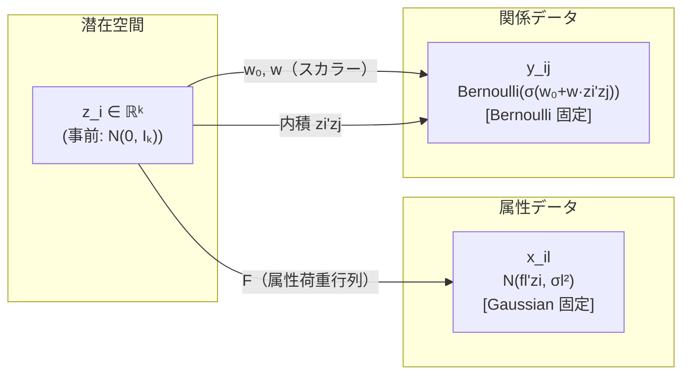

# ゼミ発表用 Notion資料 構成案

**作成日:** 2026-05-19  
**対象:** Dual-ExpFam LSM ゼミ発表（研究整理 + 今後の方針議論）  
**注意:** 完成版資料ではなく、Notion構成設計のための設計資料である。

---

## 1. このNotion資料の目的

- Dual-ExpFam LSM の研究内容をゼミで共有し、今後の研究方針を議論するための資料
- 実験結果をなぞるだけではなく、なぜこの手法が必要なのか・何が拡張されたのか・今後どこへ進めるべきかを説明する
- 「この方向でよいか」をゼミで相談する場として使う
- 完成版の発表資料ではなく、議論用の研究整理資料である

---

## 2. ゼミで最初に提示する議論したいこと

以下の問いをゼミの冒頭に提示し、議論の軸とする。

| # | 問い | 目的 |
|---|-----|------|
| Q1 | X と Y の両方を指数型分布族へ拡張する方向性は妥当か | 研究の方向性の確認 |
| Q2 | 現在の実験（A/B/C・mismatch・BIC・Control）は提案手法の有効性を示すものとして十分か | 実験設計の評価 |
| Q3 | 次に優先すべき追加実験は何か（従来手法比較・Term2/Term3ノルム・1/2修正実験など） | 実験の優先順位 |
| Q4 | 従来手法（分布が合わないデータに先行研究を適用した場合）との比較をどう設計すべきか | 比較実験の設計 |
| Q5 | X に離散・連続・混合属性が混在する場合、どう扱うべきか | モデル拡張の方向 |
| Q6 | マルチドメイン拡張はどの段階で扱うべきか | 中長期の研究計画 |
| Q7 | 潜在変数が1種類だけでよいのか（ドメインごとに潜在変数を持つべきか） | モデル設計の根本 |
| Q8 | アルゴリズム精査で最初に着手すべきことは何か（1/2問題・Term2/3寄与・EMの収束など） | 修論フェーズの優先順位 |
| Q9 | 修論・国際学会を見据えたとき、研究の主張の中心をどこに置くべきか | 研究の位置づけ |

---

## 3. Notionページ全体の構成案

### 章立て一覧

```
# ゼミ発表メモ：Dual-ExpFam LSM の整理と今後の方向性

## 0. 今日議論したいこと
## 1. 研究の全体像
## 2. 先行研究 NOLTA 2024 の概要
## 3. 先行研究の限界
## 4. 本研究の目的
## 5. 提案手法 Dual-ExpFam LSM の概要
## 6. 指数型分布族とは何か
## 7. 提案モデルの数式
## 8. 推定アルゴリズムの流れ
## 9. 実装との対応
## 10. 実験の目的
## 11. 実験設定
## 12. 実験結果
## 13. 実験から言えること・慎重に扱うべきこと
## 14. 今後の研究方針
## 15. ゼミで相談したいこと
## 16. 補足資料
```

---

### 章ごとの設計表

| 章 | 目的 | 見せる内容 | 図が必要か | トグルに入れる内容 | 話すべきこと | 根拠ファイル |
|---|---|---|---|---|---|---|
| 0. 今日議論したいこと | ゼミの方向を最初に示す | 上記 Q1〜Q9 の箇条書き | なし | なし | 「この方向でよいか確認したい」 | — |
| 1. 研究の全体像 | 研究の位置づけを一目で示す | 研究テーマ一文・先行研究との関係・本研究の新規性 | ブロック図（先行研究→本研究の拡張方向） | なし | 先行研究の特殊ケースとして本研究が包含する関係 | `CLAUDE.md`・原稿L.1-10 |
| 2. 先行研究 NOLTA 2024 | 先行研究を正確に理解させる | データ（X/Y/Z）の説明・生成モデルの直感・推定の流れ | 生成モデル図（後述 §5） | 数式（eq1・eq2）・推定の詳細 | MCEM + Laplace近似の枠組みを継承する理由 | `NOTEBOOKLM_RESEARCH_BRIEF.md` §5 |
| 3. 先行研究の限界 | 問題意識を明確にする | 分布族固定の問題・実データでの限界例 | なし | なし | 「分布が合わないデータではどうするか」 | 原稿L.6-10 |
| 4. 本研究の目的 | 動機と目的を一文で言える | 研究目的一文・先行研究との比較表 | なし | なし | 「なぜ指数型分布族なのか」 | 原稿L.10-11 |
| 5. 提案手法の概要 | 手法を直感で理解させる | 一言説明・先行研究との比較表・生成モデルの図 | 提案モデル図（後述 §7） | なし | 「何が変わったか」を3点で言う | 原稿§3・`expfam/README.md` §1 |
| 6. 指数型分布族とは何か | 数学的背景を平易に説明 | 直感説明・Gaussian/Bernoulli/Poisson の比較表 | なし | 一般形 p(x\|η)・A'/A'' の意味 | 「平均関数と分散関数で族が決まる」 | 原稿§2.3・`NOTEBOOKLM_RESEARCH_BRIEF.md` §7 |
| 7. 提案モデルの数式 | 数式を正確に伝える | 生成モデル式（eq4・eq5）・精度行列 Eq.(6) のTerm1/2/3 | なし | Q関数・E-step勾配・M-step詳細 | Term2が本研究の一般化の核心 | 原稿§3・`CLAUDE.md` 精度行列節 |
| 8. 推定アルゴリズム | EMの流れを説明 | E-step/M-stepの簡単な箇条書き | フローチャート案（後述 §8） | Adam設定・サンプリング詳細 | 「先行研究の枠組みを継承しつつ一般化」 | `NOTEBOOKLM_RESEARCH_BRIEF.md` §8 |
| 9. 実装との対応 | コード構造を整理 | クラス継承表・主要ファイル表 | なし | ファイル一覧・L.番号対応 | 「実装とのズレ（1/2問題）は認識済み」 | `expfam/README.md` §4・§5 |
| 10. 実験の目的 | 何を確認したいかを先に言う | 実験目的の箇条書き（5点） | なし | なし | 目的を先に言ってから結果を見せる | 原稿§4・`NOTEBOOKLM_RESEARCH_BRIEF.md` §10 |
| 11. 実験設定 | 実験条件を整理する | 共通設定表・シナリオA/B/C表 | なし | 実験設定の詳細（seed・EM回数等） | 設定を言って次に進む（長々と説明しない） | `expfam/README.md` §2 |
| 12. 実験結果 | 結果を正確に見せる | fig1a（n-sweep）・fig1b（mismatch）・表1・表2 | **fig1a/fig1b を本文に出す** | CSVの細かい数値・旧図との対応 | 図の読み方を先に説明してから見せる | `02_experiment_result_verification.md` |
| 13. 言えること・慎重に扱うこと | 過剰主張を避ける | 主張してよいこと5点・慎重にすべきこと5点 | なし | なし | 「未確認事項は未確認と正直に言う」 | `NOTEBOOKLM_RESEARCH_BRIEF.md` §12・§13 |
| 14. 今後の研究方針 | 次にすることを整理 | アルゴリズム精査・実験追加・モデル拡張の3軸 | なし | 詳細タスク一覧 | 「修論フェーズで何を優先するか」 | `CLAUDE.md` 残タスク節 |
| 15. ゼミで相談したいこと | 議論を引き出す | Q1〜Q9 を再掲・特に確認したい問いを強調 | なし | なし | 「この研究方向でよいかを相談したい」 | — |
| 16. 補足資料 | 詳細を格納する | 数式証明・MATLAB比較・先生対応メモへのリンク | なし | すべてトグル | 必要に応じて参照 | `docs/math_notes/`・`docs/teacher/` |

---

## 4. Notionでの見せ方ルール

### 本文に出すもの
- 研究の目的（一文）
- 先行研究の生成モデルの直感的な説明
- 提案手法が先行研究と違う点（箇条書き3点）
- 生成モデルの直感図
- 実験の目的（箇条書き）
- 図1a・図1b（提出版 `figures/` 配下）
- 主要な実験結果（表1・表2）
- 今後相談したいこと（Q1〜Q9）

### トグルに入れるもの
- 指数型分布族の一般形 $p(x|\eta) = h(x)\exp\{\eta T(x) - A(\eta)\}$
- 尤度・Q関数の詳細
- E-step 勾配の式
- 精度行列 Eq.(6) の Term1/2/3 の詳細計算
- 1/2係数問題（NOLTA 2024 PDFとの不一致、Python実装の現状）
- Python実装とのズレの詳細（L.番号付き）
- 実験 CSV の細かい数値（k-sweep 全k・n-sweep 全n）
- 参考文献・根拠ファイル名

### Notionのトグル記法（Markdown上）

```markdown
> 🔽 トグル候補：詳しい数式（精度行列 Eq.(6)）
>
> A_i = I_k + F^T V_X(m_i) F + (w^Y)^2 Σ_{j≠i} A_Y''(η_ij^Y) z_j z_j^T
> 
> [Term1/2/3 の詳細説明...]
```

---

## 5. 先行研究を図で説明する構成

### 5.1 先行研究で扱うデータ

| データ | 記号 | 形状 | 内容 |
|-------|------|------|------|
| 潜在変数行列 | Z | (n, k) | 各オブジェクトの低次元表現 |
| 属性データ | X | (n, d) | 各対象の属性（先行研究: 連続値） |
| 関係データ | Y | (n, n) | 対象間の関係（先行研究: 二値） |

### 5.2 先行研究の生成モデル

**本文に出す直感的説明（数式なし）：**

> 先行研究では、各対象 $i$ に潜在ベクトル $z_i$ を仮定する。属性データ $x_i$ は $z_i$ から Gaussian 分布で生成され、関係データ $y_{ij}$ は $z_i$ と $z_j$ の内積に基づく Bernoulli 分布から生成される。X は Gaussian、Y は Bernoulli に固定されている。

**トグルに入れる数式：**

```markdown
> 🔽 トグル候補：先行研究の生成モデル式
>
> z_i ~ N(0, I_k)
> x_il ~ N(fl^T z_i, σl²)         ... 属性 l は Gaussian 固定
> y_ij ~ Bernoulli(σ(w0 + w zi^T zj))  ... 関係は Bernoulli 固定
>        (i < j, σ はシグモイド関数)
```

### 5.3 先行研究の生成モデル図案（Mermaid）

Notion に貼るときは Mermaid ブロックとして挿入する。



**補助 ASCII 図（Mermaid が使えない場合）：**

```
┌──────────────┐
│  z_i ~ N(0, Iₖ)  │  ← 潜在ベクトル（推定対象）
└──────┬───────┘
       │ Fᵀ（荷重行列）          │ w₀ + w·zᵢᵀzⱼ
       ▼                        ▼
┌──────────────┐        ┌──────────────────────┐
│ x_il ~ N(fₗᵀzᵢ, σₗ²) │        │ y_ij ~ Bern(σ(w₀+w·zᵢᵀzⱼ)) │
│ [Gaussian 固定]       │        │ [Bernoulli 固定]             │
└──────────────┘        └──────────────────────┘
       属性データ X                    関係データ Y
```

### 5.4 先行研究の推定の流れ（本文に出す箇条書き）

1. $p(Z | X, Y)$ を推定したい — 直接計算が困難
2. Laplace 近似で $q_i(z_i) = \mathcal{N}(m_i, A_i^{-1})$ に近似
3. Monte Carlo EM でサンプリングしながら E/M ステップを繰り返す
4. BIC で潜在次元数 $k$ を選択

---

## 6. 先行研究の限界から本研究へつなげる構成

### 本文の流れ（「なぜ拡張が必要か」）

1. 先行研究では X=Gaussian、Y=Bernoulli に固定されている
2. しかし実データでは：  
   - X がカウントデータ（訪問回数など）→ Poisson が適切  
   - X が二値属性（所属有無など）→ Bernoulli が適切  
   - Y がコメント数などのカウント関係 → Poisson が適切  
   - Y が連続値の類似度スコア → Gaussian が適切  
3. 分布族が固定されていると、データ型が変わるたびにモデルを再定式化する必要がある
4. → X と Y の両方を指数型分布族に一般化する

### 先生のメモとの接続

> ゆくゆくは X に離散・連続・混合属性が入る場合にどうするか → **混合属性拡張**  
> 次にマルチドメインへ進める可能性 → **マルチドメイン拡張**  
> 潜在変数が1種類だけでよいのかも → **潜在変数設計の問題**

これらは「今回の拡張の先にある研究課題」として §14 今後の研究方針に配置する。

---

## 7. 提案手法を説明する構成

### 7.1 提案手法の一言説明（本文）

> X と Y の両方を指数型分布族として一般化し、Gaussian・Bernoulli・Poisson の任意の組み合わせを一つの枠組みで扱える属性情報付き潜在構造モデルを提案する。

### 7.2 先行研究との比較表（本文）

| 観点 | 先行研究 (NOLTA 2024) | 本研究 (Dual-ExpFam LSM) |
|-----|---------------------|------------------------|
| X の分布族 | Gaussian 固定 | Gaussian / Bernoulli / Poisson から任意指定 |
| Y の分布族 | Bernoulli 固定 | Gaussian / Bernoulli / Poisson から任意指定 |
| 精度行列 Term2 | $F^\top \Sigma^{-1} F$（Gauss のみ） | $F^\top V_X(m_i) F$（任意族に一般化） |
| F の更新 | 解析解（Gauss のみ） | Gauss: 解析解、非 Gauss: Adam 勾配上昇 |
| 推定枠組み | MCEM + Laplace 近似 | 同上（継承） |
| BIC による次元選択 | あり | あり（一般化） |

### 7.3 提案モデルの生成モデル図案（本文）

```
┌──────────────┐
│  z_i ~ N(0, Iₖ)  │  ← 潜在ベクトル（推定対象）
└──────┬───────┘
       │ fₗᵀzᵢ                  │ w₀ʸ + wʸ·zᵢᵀzⱼ
       ▼                        ▼
┌──────────────────┐   ┌──────────────────────────┐
│ x_il ~ ExpFam_X(fₗᵀzᵢ) │   │ y_ij ~ ExpFam_Y(w₀ʸ+wʸ·zᵢᵀzⱼ) │
│ [任意族を指定]          │   │ [任意族を指定]                  │
└──────────────────┘   └──────────────────────────┘
  Gauss/Bernoulli/Poisson   Gauss/Bernoulli/Poisson
       属性データ X                  関係データ Y
```

本文に出す数式（生成モデルの式 eq.4・eq.5）：

```
y_ij ~ ExpFam_Y(η_ij^Y),  η_ij^Y = w₀^Y + w^Y·zᵢᵀzⱼ  (i < j)
x_il ~ ExpFam_X(η_il^X),  η_il^X = fₗᵀzᵢ
z_i  ~ N(0, Iₖ)
w₀^Y, w^Y ∈ ℝ（スカラー）
```

### 7.4 指数型分布族の説明（本文）

**直感的説明：**

> 指数型分布族とは、Gaussian・Bernoulli・Poisson などを共通の形式で統一的に書ける分布族の総称。分布族ごとに「平均関数 $A'(\eta)$」と「分散関数 $A''(\eta)$」が定まり、これらを変えるだけで異なる族に対応できる。

**比較表（本文）：**

| 分布族 | $A'(\eta)$（平均） | $A''(\eta)$（分散） | 用途例 |
|-------|-----------------|-----------------|------|
| Gaussian | $\eta$ | $1$（/$\sigma^2$ で除す） | 連続属性・連続関係 |
| Bernoulli | $\sigma(\eta) = 1/(1+e^{-\eta})$ | $\sigma(\eta)(1-\sigma(\eta))$ | 二値属性・二値関係 |
| Poisson | $\exp(\eta)$ | $\exp(\eta)$ | カウント属性・カウント関係 |

**トグルに入れる：** 一般形 $p(x|\eta) = h(x)\exp\{\eta T(x) - A(\eta)\}$ の説明。

### 7.5 精度行列の説明（本文）

**本文に出す：** Term に分けた説明のみ。

> E-step では $z_i$ の事後分布を Gauss 分布 $\mathcal{N}(m_i, A_i^{-1})$ で近似する。  
> 精度行列 $A_i$ は以下の3項の和で表される。

| 項 | 内容 | 役割 |
|---|------|------|
| Term1: $I_k$ | 潜在変数の事前分布からの寄与 | Z の正則化 |
| Term2: $F^\top V_X(m_i) F$ | 属性データ X からの寄与 | **本研究の一般化の核心**。族によって $V_X$ が変わる |
| Term3: $(w^Y)^2 \sum_{j \neq i} A_Y''(\eta_{ij}^Y) z_j z_j^\top$ | 関係データ Y からの寄与 | Y 情報が z_i の精度に与える影響 |

**式（本文に出す）：**

$$A_i = \underbrace{I_k}_{\text{Term1}} + \underbrace{F^\top V_X(m_i) F}_{\text{Term2}} + \underbrace{(w^Y)^2 \sum_{j \neq i} A_Y''(\eta_{ij}^Y) z_j z_j^\top}_{\text{Term3（1/2 なし）}}$$

**トグルに入れる：**

```markdown
> 🔽 トグル候補：1/2係数問題について
>
> NOLTA 2024 PDF Eq.(22)(23) には Term3 に 1/2 が含まれているが、
> 本研究の再導出および MATLAB 実装（calcEtaNewton.m calcAi）とは不一致であり、
> 本研究では 1/2 なしの式を原稿採用式として整理している。
> 
> Python 実装（model_dual_expfam.py L.159, L.200）は現在も 0.5 が残存している。
> これは修論フェーズで修正予定（現時点では触らない）。
>
> 詳細: docs/math_notes/half_factor_math_explanation.md
>       docs/math_notes/half_factor_literature_code_check.md
```

---

## 8. 推定アルゴリズムを説明する構成

### 推定フローチャート案

```
初期化（F, w₀, w を設定）
         ↓
┌─────── E-step ────────────────────────────┐
│  for i = 1 to n:                          │
│    Newton 法でモード m_i を探索             │
│      （_calc_gradient / _calc_precision_matrix 使用）│
│    精度行列 A_i を計算                     │
│    q_i(z_i) = N(m_i, A_i⁻¹) からサンプリング│
│  → Z^(1), ..., Z^(L) を取得（L=5）         │
└──────────────────────────────────────────┘
         ↓
┌─────── M-step ────────────────────────────┐
│  F  ← Gauss-X: 解析解 / 非 Gauss: Adam   │
│  Σ  ← Gauss-X: 解析解 / 非 Gauss: I_d   │
│  w₀, w ← Adam 勾配上昇（/2L 正しい）      │
│  σ_y ← Gauss-Y のみ: 解析解              │
└──────────────────────────────────────────┘
         ↓
  8 反復繰り返す
         ↓
  BIC で k を選択（k ∈ {1, 2, 3, 4, 5, 6}）
```

---

## 9. 実装説明の構成

### クラス継承表（本文に表で出す）

| クラス | ファイル | 役割 |
|-------|---------|------|
| `LatentStructuralModel` | `reproduction/src/model.py` | 先行研究 Python 再現（ベースクラス） |
| `ExpFamLatentStructuralModel` | `expfam/src/model_expfam.py` | Y 側を ExpFam に拡張 |
| `DualExpFamLSM` | `expfam/src/model_dual_expfam.py` | 提案手法本体（X・Y 両方 ExpFam） |

### 主要サポートファイル（本文に表で出す）

| ファイル | 役割 |
|---------|------|
| `utils_expfam.py` | EM 実行・BIC・RMSE・Procrustes |
| `data_generator_expfam.py` | 人工データ生成 |
| `exp_scenario_lib.py` | 実験共通設定・実験関数 |

### 実装上の注意点（トグルに入れる）

```markdown
> 🔽 トグル候補：Python 実装と原稿採用式のズレ
>
> model_dual_expfam.py L.159: term3 = 0.5 * w * (Z.T @ residual_y)
> model_dual_expfam.py L.200: term3 = 0.5 * (w**2) * (...)
> → 原稿採用式の Term3 は 1/2 なし。Y 側 Term3 のみに 0.5 が残存している。
> → Term1・Term2 は原稿式と一致。
> → 修論フェーズで修正予定。現時点では触らない。
```

---

## 10. 実験の目的（§10）

本文に出す。実験結果より先に書く。

1. 正しい分布族を指定すれば、潜在変数 Z を精度よく推定できるか
2. BIC が真の潜在次元 $k^* = 3$ を正しく選択できるか
3. サンプル数 $n$ の増加に伴い推定精度が改善するか
4. 分布族の誤指定がどの程度 RMSE(Z) を悪化させるか
5. 先行研究と同一条件（Gauss-X / Bern-Y）で同等の精度が得られるか

---

## 11. 実験設定（§11）

### 共通設定（表で出す）

| 項目 | 値 |
|-----|---|
| オブジェクト数 | $n = 150$ |
| 属性次元数 | $d = 15$ |
| 真の潜在次元数 | $k^* = 3$ |
| 試行数 | 10 |
| MC サンプル数 | $L = 5$ |
| EM 反復数 | 8 |
| $k$ 探索範囲 | $\{1, 2, 3, 4, 5, 6\}$ |

### シナリオ A/B/C（表で出す）

| シナリオ | $\mathrm{ExpFam}_X$（真） | $\mathrm{ExpFam}_Y$（真） | 確認する主なこと |
|---------|------------------------|------------------------|--------------|
| A (P-B) | Poisson | Bernoulli | 先行研究と同じ Y 族で X 側の拡張を確認 |
| B (G-P) | Gaussian | Poisson | Y 側をカウントデータ（Poisson）に拡張 |
| C (B-G) | Bernoulli | Gaussian | X 側を二値化・Y 側を連続値に拡張 |

---

## 12. 実験結果の見せ方（§12）

### 図の配置

| 図 | 配置場所 | ファイル（使用するもの） |
|---|---------|----------------------|
| 図1a：n-sweep RMSE(Z) | §12 冒頭 | `figures/fig1a_n_sweep_color.pdf/png`（2026-05-07版） |
| 図1b：誤指定倍率 | §12 中盤 | `figures/fig1b_misspecification_color.pdf/png`（2026-05-07版） |
| 表1：k-sweep・BIC選択 | §12 冒頭（図1aの前） | CSV照合済み（`02_experiment_result_verification.md`） |
| 表2：Control比較 | §12 末尾 | CSV照合済み（同上） |

**注意：** `expfam/results/` 配下の図は旧版。本文には `figures/` 配下のみ使う。

### 図1b の注意事項（本文に必ず書く）

> 図1(b) は代表的な3条件（X側のみ誤指定の最大値・Y側のみ誤指定の最大値・先行研究固定条件）を示す図であり、全誤指定条件を網羅したものではない。
>
> - 図中の最大表示値：**23.6×**（シナリオ C の灰色バー = 先行研究固定条件 X=Gaussian, Y=Bernoulli）
> - 原稿本文（L.83）の「最大 41.5 倍」：X=Gaussian, Y=Poisson を**両方誤指定**した場合（CSV 全条件中の最大、図には独立したバーなし）

| 値 | 条件 | 図に表示 |
|---:|---|:---:|
| **23.6×** | Scen. C・X=Gaussian, Y=Bernoulli（先行研究固定条件） | ✓ 灰色バー |
| **41.5×** | Scen. C・X=Gaussian, Y=Poisson（両方誤指定） | ✗ バーなし |

### Scenario C の慎重な解釈（本文 + トグル）

**本文に出す：**

> Scenario C では、Y-only 条件（X 情報を除去した場合）の RMSE(Z) が提案手法とほぼ同等（0.029 vs 0.028）であった。一方、X-only 条件では RMSE(Z) = 1.102 と大きく悪化した。Y=Gaussian が Z 推定に強く寄与した可能性があるが、Term2/Term3 の定量比較は未実施であり、断定には追加検証が必要である。

**トグルに入れる：** CSV の詳細数値（Proposed/Y-only/X-only/各誤指定条件の RMSE(Z) 全行）

---

## 13. 言えること・慎重に扱うこと（§13）

### 主張してよいこと（CSV 照合済み）

1. BIC が全シナリオで $k^* = 3$ を正しく選択（10 試行平均）
2. $n = 50 \to 300$ で RMSE(Z) が削減（削減率 31〜62%）
3. 誤指定条件で最大 41.5 倍の悪化（CSV 計算値、全条件中の最大）
4. Control 条件で先行研究と実質同等（RMSE(Z) 差 0.0006 < 0.001）
5. 3 シナリオすべてで提案手法が有効に動作

### 慎重に扱うこと

1. **「X 情報が Z 推定に有効に活用されている」**：Scen. C で Y-only ≈ Proposed のため確認が必要
2. **「Newton 方向が正しい」**：Y 側 Term3 のみ 0.5 が残存しており断定不可
3. **「BIC が常に k=3 を選ぶ」**：Scen. B の BIC 差（180）は小さく、外れ試行では k=4 の可能性あり
4. **「41.5 倍を図から確認できる」**：図中の最大バーは 23.6×（灰色）。41.5× は図に表示なし
5. **「先行研究との差がゼロ」**：差は 0.0006。「実質同等」または「0.001 未満」が適切

---

## 14. 今後の研究方針（§14）

### アルゴリズムの精査（修論フェーズ）

| 課題 | 内容 | 優先度 |
|-----|------|-------|
| E-step の 0.5 削除 | `model_dual_expfam.py` L.159, L.200 の `0.5 *` 除去 | 高 |
| 1/2 修正版との比較実験 | 修正前後で RMSE(Z) の変化を確認 | 高 |
| Term2/Term3 ノルム比較 | E-step 中の $\|$Term2$\|$ vs $\|$Term3$\|$ を記録・比較 | 高 |
| Scen. B BIC の安定性 | 全 10 試行で k=3 が選ばれるか確認 | 中 |

### 実験の追加

| 課題 | 内容 | 優先度 |
|-----|------|-------|
| 従来手法との比較 | 分布が合わないデータに先行研究（固定 Gauss-X/Bern-Y）を適用した場合との比較 | 高 |
| 実データへの適用 | Wine データ等（`run_wine_dual.py` 実行済み） | 中 |
| Sigma_y の確認 | Gaussian Y の sigma_y 推定値（Y が Z を強く拘束しているかの証拠） | 中 |

### モデル拡張（将来課題）

| 方向 | 内容 |
|-----|------|
| 混合属性 | X に連続・二値・カウント属性が混在する場合 |
| マルチドメイン | 複数ドメインの Y（異なる種類の関係データ）を扱う拡張 |
| 潜在変数の設計 | 1 種類の潜在変数でよいか。ドメインごとの潜在変数も検討 |

---

## 15. ゼミで相談したいこと（§15）

§2 の Q1〜Q9 を再掲し、特に以下を強調する。

- **Q3（追加実験の優先順位）**：Term2/Term3 比較、1/2 修正実験、従来手法比較のどれを先にするか
- **Q4（従来手法比較の設計）**：先行研究を分布が合わないデータに適用した場合の比較をどう設計すべきか
- **Q5（混合属性）**：次のステップとして混合属性を扱う拡張はいつ着手すべきか
- **Q9（研究の中心主張）**：修論・国際学会を見据えたとき、何を一番の主張とするか

---

## 16. 補足資料（§16）

すべてトグルに入れる。

| 内容 | ファイル |
|-----|---------|
| 1/2 不要の数学的証明 | `docs/math_notes/half_factor_math_explanation.md` |
| MATLAB vs Python 照合表 | `docs/math_notes/half_factor_literature_code_check.md` |
| 先生への返答案（Q1/Q2/Q4） | `docs/teacher/teacher_reply_draft.md` |
| 先生への返答案（Q3：1/2 問題） | `docs/teacher/half_factor_teacher_reply.md` |
| 実験結果 CSV 照合 | `docs_for_notebooklm/02_experiment_result_verification.md` |
| 図と本文の整合性確認 | `docs_for_notebooklm/03_figure_consistency_check.md` |
| 数式・コード整合性監査 | `docs_for_notebooklm/01_formula_code_audit.md` |
| 完成版原稿 | `conference_submission_final_draft.md` |

---

## 備考

- Notion 本文は「直感的説明 → 数式（トグル）」の順で一貫させる
- 数式を出す前に必ず「何をするための式か」を一文で書く
- 実験結果のセクションは「目的 → 設定 → 図 → 読み方 → 解釈」の順
- 「23.6×」と「41.5×」は必ず区別して説明し、混同しない
- 1/2 係数問題は「NOLTA 2024 PDF との不一致」という表現に統一する
- Scenario C の Y 支配は「可能性がある」という表現に統一する
